# 1. VSCode Essential Concepts

## 1.1 VSCode User Interface
<tag>- Ref: https://code.visualstudio.com/docs/getstarted/userinterface</tag>

<r2>YET TO BE COMPLETED</r2>

## 1.2 VSCode Workspace Concept

### 1.2.1 What is a VSCode "workspace"?
<tag>- Ref: https://code.visualstudio.com/docs/editor/workspaces</tag>

A Visual Studio Code "workspace" is the collection of one or more folders that are opened in a VS Code window (instance). In most cases, you will have **a single folder opened as the workspace** but, depending on your development workflow, you can include more than one folder, using an advanced configuration called **Multi-root workspaces**.

The concept of a workspace enables VS Code to:

- Configure settings that only apply to a specific folder or folders but not others.
- Persist task and debugger launch configurations that are only valid in the context of that workspace.
- Store and restore UI state associated with that workspace (for example, the files that are opened).
- Selectively enable or disable extensions only for that workspace.

> <note><r2>You may see the terms "folder" and "workspace" used interchangeably</r2> in VS Code documentation, issues, and community discussions. Think of a workspace as the root of a project that has extra VS Code knowledge and capabilities.</note>

> <note>❗️ Important: It is also possible to open VS Code without a workspace. For example, when you open a new VS Code window by selecting a file from your platform's File menu, you will not be inside a workspace. In this mode, some of VS Code's capabilities are reduced but you can still open text files and edit them.</note>

.

#### 1.2.1.1 Single-folder Workspaces

You don't have to do anything for a folder to become a VS Code workspace other than open the folder with VS Code. Once a folder has been opened, VS Code will automatically keep track of things such as your open files and editor layout so the editor will be as you left it when you reopen that folder. You can also add other folder-specific configurations such as workspace-specific settings (versus global user settings), task definitions, and debugging launch files (see below in the [workspace settings](#workspace-settings) section).

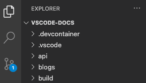

_A single-folder workspace opened inside VS Code_


#### 1.2.1.2 Multi-root Workspaces

Multi-root workspaces are an advanced capability of VS Code that allows you to configure multiple distinct folders to be part of the workspace. Instead of opening a folder as workspace, you will open a `<name>.code-workspace` JSON file that lists the folders of the workspace. For example:

```yaml
{
  "folders": [
    {
      "path": "my-folder-a"
    },
    {
      "path": "my-folder-b"
    }
  ]
}
```
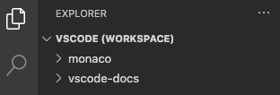

_A multi-root workspace opened in VS Code_


> <note>❗️ Important: The visual difference of having a folder opened versus opening a `.code-workspace` file can be subtle. To give you a <o>hint</o> that a `.code-workspace` file has been opened, some areas of the user interface (for example, the root of the File Explorer) show an extra <o>(Workspace) suffix</o> next to the name.

#### 1.2.1.3 Untitled Multi-root Workspaces

It is easy to add or remove folders in your workspace. You can start off by opening a folder in VS Code and then later add more folders as you see fit. Unless you already have opened a `.code-workspace` file, the first time you add a second folder to a workspace, VS Code will automatically create an "untitled" workspace. In the background, VS Code automatically maintains a `untitled.code-workspace` file for you that contains all of the folders and workspace settings from your current session. The workspace will remain "untitled" until you decide to save it to disk.

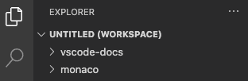

_An untitled multi-root workspace opened in VS Code_

> <note>Note: There is really no difference between an untitled workspace and a saved workspace other than the fact that an untitled workspace is automatically created for you for your convenience and will always restore until you save it. We automatically delete untitled workspaces (after asking you for confirmation) when you close a window in which an untitled workspace is opened.</note>

.

### 1.3 Workspace Settings

Workspace settings enable you to configure settings in the context of the workspace you have opened and always override global user settings. 

Refer to the [settings](#vscode-settings) documentation for a comprehensive explanation of setting scopes and their file locations.

#### 1.3.1 Single-folder Workspace Settings
Workspace settings will be stored in .vscode/settings.json when you open a folder as workspace.


_The Settings editor when a folder is opened as workspace_\

#### 1.3.2 Multi-root Workspace Settings

When you open a `.code-workspace` as workspace, all workspace settings will be added into the `.code-workspace` file.

You can still configure settings per root folder and the Settings editor will present a third setting scope called Folder Settings:

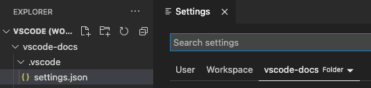
_The Settings editor when a multi-root workspace is opened_

> <note>❗️ Important: Settings configured per folder will override settings defined in the `.code-workspace` </note>

> <note>When workspace is saved on a file (`.code-workspace`) and moved to .vscode folder; if there is a existing `settings.json` file for the workspace in .vscode folder, all the settings in `settings.json` will be automatically combined with the workspace file (`.code-workspace`).</note>

.

### 1.4 VSCode Folders

Important folders can be located at `C:\Users\<user>\AppData\Roaming\Code`

#### 1.4.1 Workspaces Folder

VS Code will add temporary workspace folder for **unnamed workspaces** at `C:\Users\<user>\AppData\Roaming\Code\Workspaces`

**Unnamed Workspace:**

- Open a folder in VS Code
- Add another folder in VS Code
- *An unnamed workspace will be created automatically.*

> <note>Once the workspace is saved with "Save As", the unnamed workspace will be removed from `C:\Users\<user>\AppData\Roaming\Code\Workspaces` </note>


#### 1.4.2 User Folder

`C:\Users\<user>\AppData\Roaming\Code\User`

```yaml
globalStorage/*         // ? ST Study more about globalStorage/*
History/*               // ? ST Study more about History/*
snippets/*              // Added by Snippet Extension
sync/*                  // Sync information used in VSCode in-built sync
workspaceStorage/*      // ? ST Study more about workspaceStorage/*
keybindings.json        // Key mappings
settings.json           // User settings
syncLocalSettings.json  // Settings Sync Extension Global Settings
tasks.json              // Global tasks
```
.

### 1.5 FAQ: Workspace Concept

#### 1.5.1 What is the benefit of multi-root workspace over a folder?

The most obvious advantage is that a multi-root workspace allows you to work with multiple projects that may not be stored inside the same parent folder on disk. You can pick folders from anywhere to add to the workspace.

Even if you are mainly working in a single-folder-based project, you can benefit from using `.code-workspace` files. You can store multiple `.code-workspace` files inside the folder to provide a scoped folder-view of certain aspects of the project depending on the scenario (for example `client.code-workspace`, `server.code-workspace` to filter out unrelated folders from the File Explorer). Since `.code-workspace` files support relative paths for the `folders` section, these workspace files will work for everyone independent of where the folder is stored.

Finally, if for some projects you want to apply the same set of workspace settings or tasks/launch configurations, consider adding these into a `.code-workspace` file and add/remove these folders from that workspace.

#### 1.5.2 Does VS Code support projects or solutions?

VS Code doesn't have the concept of a "project" or "solution" as they are sometimes defined in other development tools, for example Visual Studio IDE. You may see the term "project" used in VS Code documentation but it usually means "the thing you're working on". Depending on your programming language or framework, the toolset itself may support something called a "project" to help define build configurations or enumerate included files.

#### 1.5.3 How do I delete an untitled workspace?

You can delete an untitled workspace by closing its window and dismissing the prompt to save the untitled workspace

.

## 1.3 VSCode Settings
<tag>- Ref: https://code.visualstudio.com/docs/getstarted/settings</tag>

Comprehensive explanation of setting scopes and their file locations.

.

## 1.4 VSCode Shortcuts

| Action | Shortcut |
| ------ | -------- | 
| Command Palette | `ctrl` + `shift` + `p` (or `F1`) | 


### 1.4.1 Useful Commands
- `> Reload window` : Restart VSCode
- `>` & `enter`: Execute the last command
- `> Preferences: Open Default Settings (JSON)`: Open defaults settings for VSCode including every extension, read only. <o>Useful to see all the configurable settings.</o>

#### 1.4.1.1 Search in VSCode with `>`
- `>Boo List` will search for Bookmark list
- `><start of first word> <space> <start of second word>`

#### 1.4.1.2 Looking for a File
- `ctrl` + `p` & `<filename>`

#### 1.4.1.3 Looking for a Symbol
- (`ctrl` + `p` & `# <symbol_name>`) or (`ctrl` + `t`)

#### 1.4.1.4 Looking for a Command Suggestions
- `ctrl` + `p` & `?`

#### 1.4.1.5 VSCode Tips & Tricks
- <tag>https://code.visualstudio.com/docs/getstarted/tips-and-tricks</tag>


### 1.4.2 VSCode KeyBindings

Commands are as below:

```
> Preferences: Open Default Keyboard Shortcuts // Will open the GUI
> Preferences: Open Keyboard Shortcuts // Will open the GUI
> Preferences: Open Keyboard Shortcuts (JSON) // User keybindings
```

You can open `Default Keybinding, Extension Keybinding, User Keybinding` as shown below:

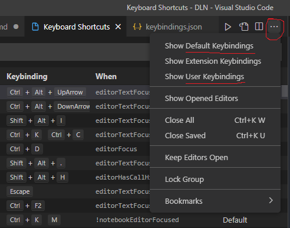

### 1.4.3 VSCode Extensions Keyboard Shortcuts

<ext>Hungry Delete Extension</ext>

Delete backspace multiple times to remove the leading tabs or whitespaces in order to return to the previous end of the line.

`ctrl` + `backspace` 

.

## 1.5 VSCode Editor

### 1.5.1 Locked Editor groups
Locked groups behave differently than unlocked groups: New editors will not open in a locked group unless explicitly moved there by the user (for example, via drag and drop).

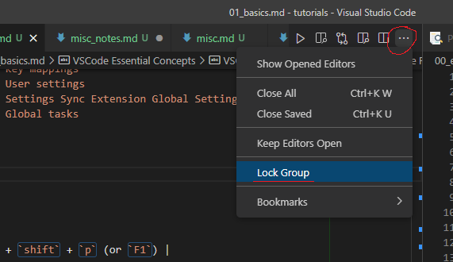

---

# 2. VSCode Extensions

## 2.1 Extensions view filters
<tag>- Ref: https://code.visualstudio.com/docs/editor/extension-marketplace#_extensions-view-filters</tag>

The Extensions view search box supports filters to help you find and manage extensions. Also, there are filters available to let you sort by popularity or ratings and search by category (for example 'Linters') and tags (for example 'node'). You can see a complete listing of all filters and sort commands by typing @ in the extensions search box and navigating through the suggestions:

- `@builtin` - Show extensions that come with VS Code. Grouped by type (Programming Languages, Themes, etc.).
- `@disabled` - Show disabled installed extensions.
- `@installed` - Show installed extensions.
- `@outdated` - Show outdated installed extensions. A newer version is available on the Marketplace.
- `@enabled` - Show enabled installed extensions. Extensions can be individually enabled/disabled.
- `@recommended` - Show recommended extensions. Grouped as Workspace specific or general use.
- `@category` - Show extensions belonging to specified category. Below are a few of supported categories. For a complete list, type @category and follow the options in the suggestion list:
- `@category:themes`
- `@category:formatters`
- `@category:linters`
- `@category:snippets`

These filters can be combined as well. For example: Use `@installed @category:themes` to view all installed themes.

If no filter is provided, the Extensions view displays the currently installed and recommended extensions.

## 2.2 Extensions Installation Location

Extensions are installed in a per user extensions folder. Depending on your platform, the location is in the following folder:

* `Windows %USERPROFILE%\.vscode\extensions`
* `macOS ~/.vscode/extensions`
* `Linux ~/.vscode/extensions`

You can change the location by launching VS Code with the` --extensions-dir` `<dir>` command-line option.


## 2.3 Sync VSCode Extensions

<r2>VSCode in-built `>Settings Sync` will not sync the installed extensions.</r2> 

Use one of the following methods:

### 2.3.1 Manual Extension Sync Method

In windows power shell,

```
    PS C:\Users\chath> code --list-extensions | % { "code --install-extension $_" }
    code --install-extension aaron-bond.better-comments
    code --install-extension alefragnani.Bookmarks
    code --install-extension alefragnani.project-manager
    code --install-extension Atishay-Jain.All-Autocomplete
    code --install-extension CodeStream.codestream
    code --install-extension codezombiech.gitignore
    code --install-extension eamodio.gitlens
    code --install-extension formulahendry.code-runner
    code --install-extension GitHub.copilot
    code --install-extension Gruntfuggly.todo-tree
    code --install-extension IBM.output-colorizer
    code --install-extension inu1255.easy-snippet
    code --install-extension jasonlhy.hungry-delete
    code --install-extension jeff-hykin.better-cpp-syntax
    code --install-extension johnpapa.vscode-peacock
    code --install-extension karigari.chat
    code --install-extension KevinRose.vsc-python-indent
    code --install-extension lacroixdavid1.vscode-format-context-menu
    code --install-extension lostintangent.vsls-whiteboard
    code --install-extension mhutchie.git-graph
    code --install-extension mikestead.dotenv
    code --install-extension ms-azuretools.vscode-docker
    code --install-extension ms-python.python
    code --install-extension ms-python.vscode-pylance
    code --install-extension ms-toolsai.jupyter
    code --install-extension ms-toolsai.jupyter-keymap
    code --install-extension ms-toolsai.jupyter-renderers
    code --install-extension ms-vscode-remote.remote-wsl
    code --install-extension ms-vscode.cpptools-themes
    code --install-extension ms-vsliveshare.vsliveshare
    code --install-extension ms-vsliveshare.vsliveshare-audio
    code --install-extension njpwerner.autodocstring
    code --install-extension RedVanWorkshop.explorer-exclude-vscode-extension
    code --install-extension Shan.code-settings-sync
    code --install-extension streetsidesoftware.code-spell-checker
    code --install-extension tkrkt.linenote
    code --install-extension tomoki1207.pdf
    code --install-extension travisthieman.better-search
    code --install-extension VisualStudioExptTeam.vscodeintellicode
    code --install-extension yzhang.markdown-all-in-one
    code --install-extension ziyasal.vscode-open-in-github
```

- save the above in a file, and run it on the other PC.

### 2.3.2 Automatic Extension Sync Method

- Use <ext>Settings Sync Extension</ext>
- Use the command `> Sync`
- <ext>Setting Sync Extension</ext>, by default syncs `C:\Users\<user>\AppData\Roaming\Code\User` folder

more details can be found [here.](../02_extensions/00_sync.md)

## 2.4 Delete All Installed Extensions

- Delete everything in  `C:\Users\<user>\.vscode\extensions`
- User settings are stored in `C:\Users\<user>\AppData\Roaming\Code\User` 

> <note>❗️ Important: Be cautious when deleting `C:\Users\<user>\AppData\Roaming\Code\User`. It may have other useful [user-data folders](#user-folder) which you may not want to delete.

## 2.5 Different Extensions for Different VSCode Workspaces
<tag>- Ref: https://stackoverflow.com/questions/61850069/separate-visual-studio-code-workspace-with-different-extensions-for-different-pr</tag>

install extensions and then enable/disable them on specific workspaces.

1. Open a workspace

2. From the Extensions panel, click on the gear icon of each extension

   - If it's enabled, you can disable it on this workspace
    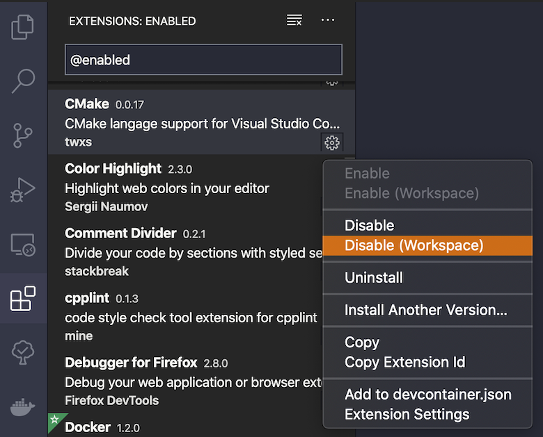


   - If it's disabled, you can enable it for this workspace
    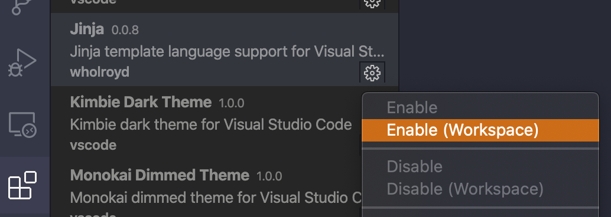

3. Click on the three dots at the top-right to list either all enabled or disabled
    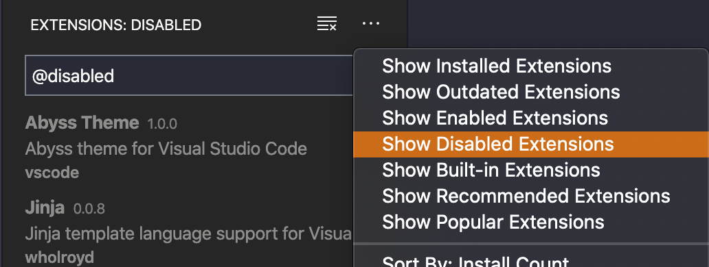


<r2>Unfortunately no way to configure this from `settings.json` file (user, workspace, or folder)</r2>, as the [extensions information does not seem to be stored there:](https://github.com/microsoft/vscode/issues/15611#issuecomment-349231959)

> <note>Enabled/Disabled extensions are not stored in workspace settings. Instead it is stored in local storage cache. You can manage them from the extensions view.</note>

More information on Managing Extensions can be found in the [Visual Studio Code documentation](https://code.visualstudio.com/docs/editor/extension-marketplace#_manage-extensions).

If you want to create a shareable list of extensions for specific workspaces (for example, perhaps to commit to source control or sharing with teammates), you can specify a list of `recommended extensions` per workspace.

### Configure Recommended Extension List

1. Open the command palette
2. Enter `Extensions: Configure Recommended Extensions (Workspace)`
3. Enter a list of extensions IDs
   - For example, you want to recommend the `"Visual Studio Code Ruby"` extension

        ```yaml
        "extensions": {
            "recommendations": [
                "wingrunr21.vscode-ruby"
            ]
        }
        ```

    - The format is {publisherName}.{extensionName}

    - Can fetch it via extension's page in VSCode
    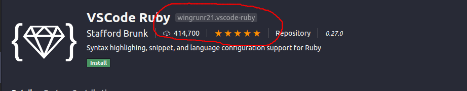


4. When the user opens the workspace for the first time, they will be notified of recommended extensions to install.
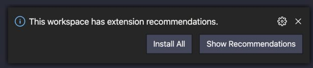
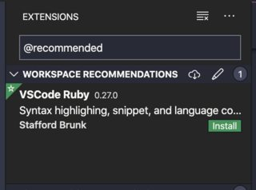

---

# 3. View an HTML file in browser with VSCode
<tag>- Ref: https://stackoverflow.com/questions/30039512/how-to-view-an-html-file-in-the-browser-with-visual-studio-code</tag>

## 3.1 Option 01: Using a task

1. Open the Command Palette.

2. \>Tasks: Configure Task
Selecting it will open the tasks.json file. Delete the script displayed and replace it by the following:

```yaml
{
    "version": "0.1.0",
    "command": "explorer",    
    "windows": {
        "command": "explorer.exe"
    },
    "args": ["test.html"]
}
```
Remember to change the `"args"` section of the tasks.json file to the name of your file. This will always open that specific file when you hit F5.

You may also set the this to open <o>whichever file you have open at the time</o> by using `["${file}"]` as the value for `"args"`.

3. Save the file.

4. Switch back to your html file (in this example it's "text.html"), and press `ctrl` + `shift` + `b` to view your page in your Web Browser.


## 3.2 Option 02: <ext>Live Server Extension</ext> <o>_(recommended)_</o>

Supports one click launch from status bar. Some of the features:

- One Click Launch from Status Bar
- Live Reload
- Support for Chrome Debugging Attachment


# 4. VSCode Tasks

`tasks.json`

## 4.1 Check variable's value 

To check a variable's runtime value, create a VS Code task to output the variable value to the console. Run (`> Tasks: Run Task`) the following simple `'echo'` task in `tasks.json`:

```yaml
{
	"version": "2.0.0",
	"tasks": [
	  {
		"label": "echo",
		"type": "shell",
		"command": "echo ${workspaceFolder}"
	  }
	]
}
```

## 4.2 Task to run launch configurations
<tag>- Ref: https://stackoverflow.com/questions/70822080/run-a-specific-launch-from-task-in-vscode</tag>

Following is an example to debug a php website. 
- Listen for xDebug
- Open Chrome Browser

1. Install VSCode extension `Launch Configs`\
<tag>Ref: https://marketplace.visualstudio.com/items?itemName=ArturoDent.launch-config
</tag>

2. In `settings.json:` Setup a command to start launch config(s)

```yaml
"launches": {
    // Run an array of launch configurations from any launch.json in the workspace
    "RunLaunchArray": ["Listen for XDebug", "Launch Chrome against localhost"]
}
```

3. In `launch.json:`

```yaml
{
    "version": "0.2.0",
    "configurations": [
        {
            "type": "php",
            "request": "launch",
            "name": "Listen for XDebug",
            "port": 9000
        },
        {
            "type": "pwa-chrome",
            "request": "launch",
            "name": "Launch Chrome against localhost",
            "url": "http://localhost/tbb_2016/",
            "webRoot": "${workspaceFolder}"
        }
    ]
}
```

4. In `tasks.json:`

```yaml
{
	"version": "2.0.0",
	"tasks": [
		{
			"label": "echo",
			"type": "shell",
			"command": "${command:launches.RunLaunchArray}",
			"problemMatcher": []
		}
	]
}
```


Optionally place a keybinding in `keybindings.json:`

```yaml
// Place your key bindings in this file to override the defaults
[
    {
        // The following command will run when `F5` is pressed
        "key": "F5",
        "command": "launches.RunLaunchArray",
        "when": "editorFocus" // Optional
    }
]
```


# 5. VSCode Launch

`launch.json`

## 5.1 Pre-launch a task before the debug launch

You can define a `task` in `tasks.json` file and specify that as the `preLaunchTask` in  `launch.json` and the **task will be executed before debugging begins.**

`tasks.json:`

```yaml
{
    "version": "2.0.0",
    "tasks": [{
        "label": "echotest",
        "command": "echo", // Could be any other shell command
        "args": ["test"],
        "type": "shell"
    }]
}
```

`launch.json`:

```yaml
{
    "configurations": [
        {
            // ...
            "preLaunchTask": "echotest", // The name of the task defined above
            // ...
        }
    ]   
}
```

Tasks documentation:\
https://code.visualstudio.com/docs/editor/tasks

Launch configuration:\
https://code.visualstudio.com/docs/editor/debugging#_launch-configurations


# 6. Customize Context Menu in VS Code
<tag>- Ref: https://stackoverflow.com/questions/46714353/how-to-customize-context-menu-in-visual-studio-code</tag>

Goto extension's `package.json`, refer to `contributes.menus` section. The text editor context menu is called `editor/context`. Modify this section.

i.e. Bookmarks plugin

```yaml
{
    "name": "Bookmarks",
    ...
    "contributes": {
        ...
        "menus": {
            ...
            "editor/context": [
                {
                    "command": "bookmarks.toggle",
                    "group": "bookmarks",
                    "when": "editorTextFocus && config.bookmarks.showCommandsInContextMenu"
                },
                {
                    "command": "bookmarks.jumpToNext",
                    "group": "bookmarks@1",
                    "when": "editorTextFocus && config.bookmarks.showCommandsInContextMenu"
                },
                {
                    "command": "bookmarks.jumpToPrevious",
                    "group": "bookmarks@1",
                    "when": "editorTextFocus && config.bookmarks.showCommandsInContextMenu"
                }
            ],
            ....
        },
        ....
    },
    ....
}
```

---

# <o>7. VSCode on Web Browser !!</o>
<tag>- Ref: https://code.visualstudio.com/blogs/2021/10/20/vscode-dev</tag>\
<tag>- Ref: https://www.youtube.com/watch?v=hilznKQij7A&list=PLj6YeMhvp2S6uB23beQaffszlavLq3lNq</tag>

Checkout https://vscode.dev/

---

# 8. VSCode Future Features

- Only show markdown headers in outline view (without `#` symbol)\
<tag>- Ref: https://stackoverflow.com/questions/71032944/vscode-notebooks-is-it-possible-to-show-only-markdown-headers-in-outline
</tag>

---

# 9. FAQ

## 7.1 How to add `Edit with VSCode` to Windows Context Menu

You can reinstall VSCode and during installation choose, `Open with` option.

Alternatively,\
<tag>- Ref: https://thisdavej.com/right-click-on-windows-folder-and-open-with-visual-studio-code/</tag>

Create the following `.reg` file and run it.

```
Windows Registry Editor Version 5.00

; To use (expand) environment variables in the registry, the value must be of 
; the type REG_EXPAND_SZ. A REG_EXPAND_SZ is represented as HEX in reg exports.


; Right click on any file

[HKEY_CURRENT_USER\Software\Classes\*\shell\vscode]
@="Open with Code"
"Icon"=hex(2):25,00,55,00,53,00,45,00,52,00,50,00,52,00,4f,00,46,00,49,00,4c,\
  00,45,00,25,00,5c,00,41,00,70,00,70,00,44,00,61,00,74,00,61,00,5c,00,4c,00,\
  6f,00,63,00,61,00,6c,00,5c,00,50,00,72,00,6f,00,67,00,72,00,61,00,6d,00,73,\
  00,5c,00,4d,00,69,00,63,00,72,00,6f,00,73,00,6f,00,66,00,74,00,20,00,56,00,\
  53,00,20,00,43,00,6f,00,64,00,65,00,5c,00,43,00,6f,00,64,00,65,00,2e,00,65,\
  00,78,00,65,00,2c,00,30,00,00,00
; HEX value: %USERPROFILE%\AppData\Local\Programs\Microsoft VS Code\Code.exe,0

[HKEY_CURRENT_USER\Software\Classes\*\shell\vscode\command]
@=hex(2):22,00,25,00,55,00,53,00,45,00,52,00,50,00,52,00,4f,00,46,00,49,00,4c,\
  00,45,00,25,00,5c,00,41,00,70,00,70,00,44,00,61,00,74,00,61,00,5c,00,4c,00,\
  6f,00,63,00,61,00,6c,00,5c,00,50,00,72,00,6f,00,67,00,72,00,61,00,6d,00,73,\
  00,5c,00,4d,00,69,00,63,00,72,00,6f,00,73,00,6f,00,66,00,74,00,20,00,56,00,\
  53,00,20,00,43,00,6f,00,64,00,65,00,5c,00,43,00,6f,00,64,00,65,00,2e,00,65,\
  00,78,00,65,00,22,00,20,00,22,00,25,00,31,00,22,00,00,00
; HEX value: "%USERPROFILE%\AppData\Local\Programs\Microsoft VS Code\Code.exe" "%1"


; Right click on a directory

[HKEY_CURRENT_USER\Software\Classes\Directory\shell\vscode]
@="Open with Code"
"Icon"=hex(2):25,00,55,00,53,00,45,00,52,00,50,00,52,00,4f,00,46,00,49,00,4c,\
  00,45,00,25,00,5c,00,41,00,70,00,70,00,44,00,61,00,74,00,61,00,5c,00,4c,00,\
  6f,00,63,00,61,00,6c,00,5c,00,50,00,72,00,6f,00,67,00,72,00,61,00,6d,00,73,\
  00,5c,00,4d,00,69,00,63,00,72,00,6f,00,73,00,6f,00,66,00,74,00,20,00,56,00,\
  53,00,20,00,43,00,6f,00,64,00,65,00,5c,00,43,00,6f,00,64,00,65,00,2e,00,65,\
  00,78,00,65,00,2c,00,30,00,00,00
; HEX value: %USERPROFILE%\AppData\Local\Programs\Microsoft VS Code\Code.exe,0

[HKEY_CURRENT_USER\Software\Classes\Directory\shell\vscode\command]
@=hex(2):22,00,25,00,55,00,53,00,45,00,52,00,50,00,52,00,4f,00,46,00,49,00,4c,\
  00,45,00,25,00,5c,00,41,00,70,00,70,00,44,00,61,00,74,00,61,00,5c,00,4c,00,\
  6f,00,63,00,61,00,6c,00,5c,00,50,00,72,00,6f,00,67,00,72,00,61,00,6d,00,73,\
  00,5c,00,4d,00,69,00,63,00,72,00,6f,00,73,00,6f,00,66,00,74,00,20,00,56,00,\
  53,00,20,00,43,00,6f,00,64,00,65,00,5c,00,43,00,6f,00,64,00,65,00,2e,00,65,\
  00,78,00,65,00,22,00,20,00,22,00,25,00,31,00,22,00,00,00
; HEX value: "%USERPROFILE%\AppData\Local\Programs\Microsoft VS Code\Code.exe" "%1"


; Right click on the background inside a directory

[HKEY_CURRENT_USER\Software\Classes\Directory\Background\shell\vscode]
@="Open with Code"
"Icon"=hex(2):25,00,55,00,53,00,45,00,52,00,50,00,52,00,4f,00,46,00,49,00,4c,\
  00,45,00,25,00,5c,00,41,00,70,00,70,00,44,00,61,00,74,00,61,00,5c,00,4c,00,\
  6f,00,63,00,61,00,6c,00,5c,00,50,00,72,00,6f,00,67,00,72,00,61,00,6d,00,73,\
  00,5c,00,4d,00,69,00,63,00,72,00,6f,00,73,00,6f,00,66,00,74,00,20,00,56,00,\
  53,00,20,00,43,00,6f,00,64,00,65,00,5c,00,43,00,6f,00,64,00,65,00,2e,00,65,\
  00,78,00,65,00,2c,00,30,00,00,00
; HEX value: %USERPROFILE%\AppData\Local\Programs\Microsoft VS Code\Code.exe,0

[HKEY_CURRENT_USER\Software\Classes\Directory\Background\shell\vscode\command]
@=hex(2):22,00,25,00,55,00,53,00,45,00,52,00,50,00,52,00,4f,00,46,00,49,00,4c,\
  00,45,00,25,00,5c,00,41,00,70,00,70,00,44,00,61,00,74,00,61,00,5c,00,4c,00,\
  6f,00,63,00,61,00,6c,00,5c,00,50,00,72,00,6f,00,67,00,72,00,61,00,6d,00,73,\
  00,5c,00,4d,00,69,00,63,00,72,00,6f,00,73,00,6f,00,66,00,74,00,20,00,56,00,\
  53,00,20,00,43,00,6f,00,64,00,65,00,5c,00,43,00,6f,00,64,00,65,00,2e,00,65,\
  00,78,00,65,00,22,00,20,00,22,00,25,00,56,00,22,00,00,00
; HEX value: "%USERPROFILE%\AppData\Local\Programs\Microsoft VS Code\Code.exe" "%V"
```
Ref: 


To delete the registry keys, save the following in `.reg` file and run:

```
Windows Registry Editor Version 5.00

[-HKEY_CLASSES_ROOT\*\shell\Open with VS Code]
[-HKEY_CLASSES_ROOT\*\shell\Open with VS Code\command]
[-HKEY_CLASSES_ROOT\Directory\shell\vscode]
[-HKEY_CLASSES_ROOT\Directory\shell\vscode\command]
[-HKEY_CLASSES_ROOT\Directory\Background\shell\vscode]
[-HKEY_CLASSES_ROOT\Directory\Background\shell\vscode\command]
```
.

## 7.2 Show VSCode Notifications Previously Configured "Do not show" ?

How to show the VSCode notifications which appears bottom right corner, if they were configured to not show by clicking "Do not show".

i.e. 
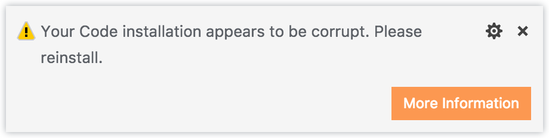

**<o>On going discussion:</o>**\
<tag>- Ref: https://github.com/microsoft/vscode/issues/24815</tag>

> <note>Unfortunately, VSCode does not have plans to implement this feature in the near future. But there are some workarounds suggested by users.</note>

<!-- HK Solution 01 -->
Solution 01
- Close any opened VSCode and make sure it ain't running in the background
- Go to `C:\Users\<user>\AppData\Roaming\Code\User`
- Rename `globalStorage` into `globalStorage2`
> <note>❗️ Important: THIS WILL REMOVE ALL YOUR GLOBAL SETTINGS</note>

\# TODO Find out more: