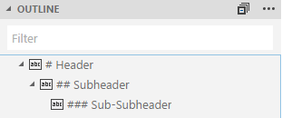
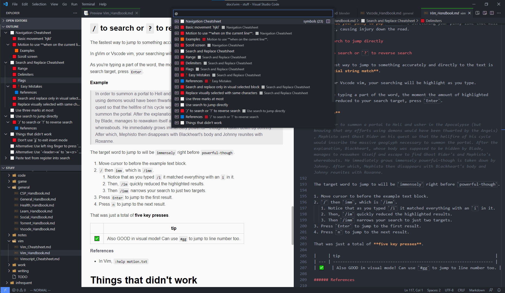
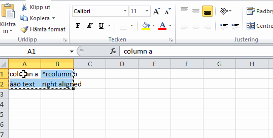

# Markdown Basics for VSCode

## Markdown Preview
<tag>- Ref: https://code.visualstudio.com/docs/languages/markdown</tag>

VSCode natively support markdown preview. This is for the markdown files (`.md` extension) but not for jupyter notebooks (`.ipynb` files). You can also use your own CSS in the Markdown preview with the `"markdown.styles": []` setting.

The native <o>markdown preview</o> capabilities are not powerful enough to render emoji, mermaid/plantuml diagrams, etc. Also, <r2>GitHub will sometime render the markdown elements/styles differently</r2> from what is shown in VSCode.

Hence two options are available.

### Option 01: <ext>Markdown Preview Github Styling Extension</ext>
<tag>- from Matt Bierner</tag>

Preview what your markdown will look like rendered on GitHub. Extends VS Code's built-in markdown preview. Includes both light or dark Github themes. Customize styling using your own markdown.styles css

> <note>❗️ Important: This extension only styles the Markdown preview. Use this [extension pack](https://marketplace.visualstudio.com/items?itemName=bierner.github-markdown-preview) to add support for other GitHub markdown features like `:emoji:` and `- [ ] tasklists`.</note>

**Configuration**

This theme is configurable in a similar manner to GitHub's appearance settings.

- <o>`markdown-preview-github-styles.color:`</o>
Theme Sets the GitHub color theme for the Markdown preview. Default: auto.
  - `auto`: Automatically match the editor color theme.
  - `system`: Sync to the system/OS color theme.
  - `light`: Always use the GitHub site's light theme.
  - `dark`: Always use the GitHub site's dark theme.

**Support for Coded Uml**

- mermaid: supported via <ext>Markdown Preview for Mermaid Extension</ext> <tag>- from Matt Bierner</tag>
- plantuml: supported via <ext>Plant UML Extension</ext> <tag>- from jebbs</tag>. 

> <note>Local plantuml server is not supported. Follow the instructions [here](https://blog.anoff.io/2018-07-31-diagrams-with-plantuml/)</note>


### Option 02: <ext>Markdown Preview Enhanced Extension</ext> <o>*(recommended)*</o>
<tag>- from Yiyi Wang</tag>

Markdown Preview Enhanced is an extension that provides you with many useful functionalities such as `automatic scroll sync`, `math typesetting`, `mermaid`, `PlantUML`, `pandoc`, `PDF export`, `code chunk`, `presentation` writer (`reveal.js`), etc.

> <note>No need of additional/other markdown related extensions. Everything comes packed up.</note>

## Outline View for Markdown
<tag>- Ref: https://github.com/microsoft/vscode/issues/53992</tag>

The Outline view for Markdown displays headers and sub-headers in a structured way as below:



To remove "#" symbol from the title:

1. Goto `<vsode installation>\resources\app\extensions\markdown-language-features\dist\extension.js`
2. Replace `getSymbiolName(e)` {: js} as below:
   
```js
getSymbolName(e){ return e.text.replace(/<[^>]*>?/gm, ''); }
// removes '#' symbol and strips the html tags from the header
```

Alternatively, for some advanced formatting:

```js
getSymbolName(e){
    var symbol = {
        "1": "⬜",
        "2": "🟥",
        "3": "🟧",
        "4": "🟨",
        "5": "🟩",
        "6": "🟦",
        "7": "🟪",
        "8": "🟫",
    };
    if (1 <= e.level && e.level <= 8) {
        return symbol[e.level] + " " + e.text;
    }
    return "#".repeat(e.level) + " " + e.text;
}
```



---

# Colors in Markdown

Colors are <r2>not supported in GitHub, but GitLab.</r2> Alternatively, you can use the following:

| b             | b             |
|---------------|---------------|
| 🔴 Red Circle | 🔴 Red Circle |


🔴 Red Circle
🟠 Orange Circle
🟡 Yellow Circle
🟢 Green Circle
🔵 Blue Circle
🟣 Purple Circle
🟤 Brown Circle
⚫ Black Circle
⚪ White Circle
🟥 Red Square
🟧 Orange Square
🟨 Yellow Square
🟩 Green Square
🟦 Blue Square
🟪 Purple Square
🟫 Brown Square
⬛ Black Large Square
⬜ White Large Square
◼️ Black Medium Square
◻️ White Medium Square
◾ Black Medium-Small Square
◽ White Medium-Small Square
▪️ Black Small Square
▫️ White Small Square
🔶 Large Orange Diamond
🔷 Large Blue Diamond
🔸 Small Orange Diamond
🔹 Small Blue Diamond
🔺 Red Triangle Pointed Up
🔻 Red Triangle Pointed Down
💠 Diamond with a Dot
🔘 Radio Button
🔳 White Square Button
🔲 Black Square Button

https://emojipedia.org/symbols/

💕 Symbols
Heart emojis, clocks, arrows, signs and shapes.

💘 Heart with Arrow
💝 Heart with Ribbon
💖 Sparkling Heart
💗 Growing Heart
💓 Beating Heart
💞 Revolving Hearts
💕 Two Hearts
💟 Heart Decoration
❣️ Heart Exclamation
💔 Broken Heart
❤️‍🔥 Heart on Fire
❤️‍🩹 Mending Heart
❤️ Red Heart
🧡 Orange Heart
💛 Yellow Heart
💚 Green Heart
💙 Blue Heart
💜 Purple Heart
🤎 Brown Heart
🖤 Black Heart
🤍 White Heart
💯 Hundred Points
💢 Anger Symbol
💬 Speech Balloon
👁️‍🗨️ Eye in Speech Bubble
🗨️ Left Speech Bubble
🗯️ Right Anger Bubble
💭 Thought Balloon
💤 Zzz
💮 White Flower
♨️ Hot Springs
💈 Barber Pole
🛑 Stop Sign
🕛 Twelve O’Clock
🕧 Twelve-Thirty
🕐 One O’Clock
🕜 One-Thirty
🕑 Two O’Clock
🕝 Two-Thirty
🕒 Three O’Clock
🕞 Three-Thirty
🕓 Four O’Clock
🕟 Four-Thirty
🕔 Five O’Clock
🕠 Five-Thirty
🕕 Six O’Clock
🕡 Six-Thirty
🕖 Seven O’Clock
🕢 Seven-Thirty
🕗 Eight O’Clock
🕣 Eight-Thirty
🕘 Nine O’Clock
🕤 Nine-Thirty
🕙 Ten O’Clock
🕥 Ten-Thirty
🕚 Eleven O’Clock
🕦 Eleven-Thirty
🌀 Cyclone
♠️ Spade Suit
♥️ Heart Suit
♦️ Diamond Suit
♣️ Club Suit
🃏 Joker
🀄 Mahjong Red Dragon
🎴 Flower Playing Cards
🔇 Muted Speaker
🔈 Speaker Low Volume
🔉 Speaker Medium Volume
🔊 Speaker High Volume
📢 Loudspeaker
📣 Megaphone
📯 Postal Horn
🔔 Bell
🔕 Bell with Slash
🎵 Musical Note
🎶 Musical Notes
💹 Chart Increasing with Yen
🛗 Elevator
🏧 ATM Sign
🚮 Litter in Bin Sign
🚰 Potable Water
♿ Wheelchair Symbol
🚹 Men’s Room
🚺 Women’s Room
🚻 Restroom
🚼 Baby Symbol
🚾 Water Closet
⚠️ Warning
🚸 Children Crossing
⛔ No Entry
🚫 Prohibited
🚳 No Bicycles
🚭 No Smoking
🚯 No Littering
🚱 Non-Potable Water
🚷 No Pedestrians
📵 No Mobile Phones
🔞 No One Under Eighteen
☢️ Radioactive
☣️ Biohazard
⬆️ Up Arrow
↗️ Up-Right Arrow
➡️ Right Arrow
↘️ Down-Right Arrow
⬇️ Down Arrow
↙️ Down-Left Arrow
⬅️ Left Arrow
↖️ Up-Left Arrow
↕️ Up-Down Arrow
↔️ Left-Right Arrow
↩️ Right Arrow Curving Left
↪️ Left Arrow Curving Right
⤴️ Right Arrow Curving Up
⤵️ Right Arrow Curving Down
🔃 Clockwise Vertical Arrows
🔄 Counterclockwise Arrows Button
🔙 Back Arrow
🔚 End Arrow
🔛 On! Arrow
🔜 Soon Arrow
🔝 Top Arrow
🛐 Place of Worship
⚛️ Atom Symbol
🕉️ Om
✡️ Star of David
☸️ Wheel of Dharma
☯️ Yin Yang
✝️ Latin Cross
☦️ Orthodox Cross
☪️ Star and Crescent
☮️ Peace Symbol
🕎 Menorah
🔯 Dotted Six-Pointed Star
♈ Aries
♉ Taurus
♊ Gemini
♋ Cancer
♌ Leo
♍ Virgo
♎ Libra
♏ Scorpio
♐ Sagittarius
♑ Capricorn
♒ Aquarius
♓ Pisces
⛎ Ophiuchus
🔀 Shuffle Tracks Button
🔁 Repeat Button
🔂 Repeat Single Button
▶️ Play Button
⏩ Fast-Forward Button
⏭️ Next Track Button
⏯️ Play or Pause Button
◀️ Reverse Button
⏪ Fast Reverse Button
⏮️ Last Track Button
🔼 Upwards Button
⏫ Fast Up Button
🔽 Downwards Button
⏬ Fast Down Button
⏸️ Pause Button
⏹️ Stop Button
⏺️ Record Button
⏏️ Eject Button
🎦 Cinema
🔅 Dim Button
🔆 Bright Button
📶 Antenna Bars
📳 Vibration Mode
📴 Mobile Phone Off
♀️ Female Sign
♂️ Male Sign
✖️ Multiply
➕ Plus
➖ Minus
➗ Divide
🟰 Heavy Equals Sign
♾️ Infinity
‼️ Double Exclamation Mark
⁉️ Exclamation Question Mark
❓ Red Question Mark
❔ White Question Mark
❕ White Exclamation Mark
❗ Red Exclamation Mark
〰️ Wavy Dash
💱 Currency Exchange
💲 Heavy Dollar Sign
⚕️ Medical Symbol
♻️ Recycling Symbol
⚜️ Fleur-de-lis
🔱 Trident Emblem
📛 Name Badge
🔰 Japanese Symbol for Beginner
⭕ Hollow Red Circle
✅ Check Mark Button
☑️ Check Box with Check
✔️ Check Mark
❌ Cross Mark
❎ Cross Mark Button
➰ Curly Loop
➿ Double Curly Loop
〽️ Part Alternation Mark
✳️ Eight-Spoked Asterisk
✴️ Eight-Pointed Star
❇️ Sparkle
©️ Copyright
®️ Registered
™️ Trade Mark

\#️⃣ Keycap Number Sign
*️⃣ Keycap Asterisk
0️⃣ Keycap Digit Zero
1️⃣ Keycap Digit One
2️⃣ Keycap Digit Two
3️⃣ Keycap Digit Three
4️⃣ Keycap Digit Four
5️⃣ Keycap Digit Five
6️⃣ Keycap Digit Six
7️⃣ Keycap Digit Seven
8️⃣ Keycap Digit Eight
9️⃣ Keycap Digit Nine
🔟 Keycap: 10
🔠 Input Latin Uppercase
🔡 Input Latin Lowercase
🔢 Input Numbers
🔣 Input Symbols
🔤 Input Latin Letters
🅰️ A Button (Blood Type)
🆎 AB Button (Blood Type)
🅱️ B Button (Blood Type)
🆑 CL Button
🆒 Cool Button
🆓 Free Button
ℹ️ Information
🆔 ID Button
Ⓜ️ Circled M
🆕 New Button
🆖 NG Button
🅾️ O Button (Blood Type)
🆗 OK Button
🅿️ P Button
🆘 SOS Button
🆙 Up! Button
🆚 Vs Button
🈁 Japanese “Here” Button
🈂️ Japanese “Service Charge” Button
🈷️ Japanese “Monthly Amount” Button
🈶 Japanese “Not Free of Charge” Button
🈯 Japanese “Reserved” Button
🉐 Japanese “Bargain” Button
🈹 Japanese “Discount” Button
🈚 Japanese “Free of Charge” Button
🈲 Japanese “Prohibited” Button
🉑 Japanese “Acceptable” Button
🈸 Japanese “Application” Button
🈴 Japanese “Passing Grade” Button
🈳 Japanese “Vacancy” Button
㊗️ Japanese “Congratulations” Button
㊙️ Japanese “Secret” Button
🈺 Japanese “Open for Business” Button
🈵 Japanese “No Vacancy” Button


## Create a Markdown Table from Excel
1. Copy the content to excel stylesheet
2. Use `text to columns` and `columns to rows`
3. Using <ext>Excel to Markdown Extension</ext>, press `shift` +  `alt` + `v`



---

# Markdown Syntax Highlighting

Supported Languages: [Click Here](https://github.com/jincheng9/markdown_supported_languages)

**Inline syntax highlighting** 

- Not supported natively. But GitHub has some support.
- Ref: https://stackoverflow.com/questions/23226224/inline-code-syntax-highlighting-in-github-markdown

---

# GitHub for Markdown

## GitHub Flavored Markdown Specification
<tag>- Ref: https://github.github.com/gfm/</tag>

> <note>GitHub strips the html tags</note>

GitHub Flavored Markdown, often shortened as GFM, is the dialect of Markdown that is currently supported for user content on GitHub.com and GitHub Enterprise.

This formal specification, based on the CommonMark Spec, defines the syntax and semantics of this dialect.

GFM is a strict superset of CommonMark. All the features which are supported in GitHub user content and that are not specified on the original CommonMark Spec are hence known as extensions, and highlighted as such.

While GFM supports a wide range of inputs, it’s worth noting that GitHub.com and GitHub Enterprise perform additional post-processing and sanitization after GFM is converted to HTML to ensure security and consistency of the website.

## GitHub Pages
<tag>- Ref: https://harrywang.medium.com/how-to-host-static-markdown-web-pages-using-github-pages-61f80a3a5136</tag>

<r2>\# TODO: YET TO BE COMPLETED</r2>

---

# Git Book for Markdown

---

# Research (FIND OUT)

\# TODO: Search the following

## Hidden Markdown in .md File?

\# * IM: important to hide todo tree markers (IM, ST, HK, etc) like this one.

<!-- \# HK: hidden with html comments, but Todo Tree includes the closing bracket of the comment -->

Currently it is supported via html comments.

```html
<!-- # ? ST this is a comment >
```