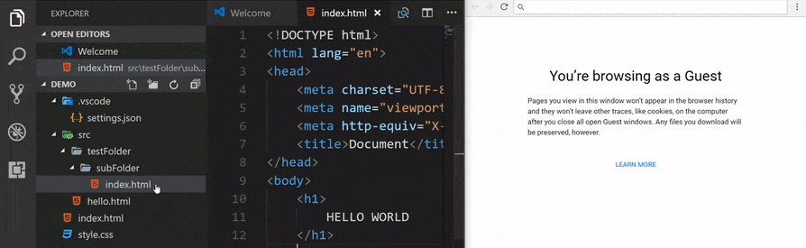

> Open this document in <ext>Markdown Preview Enhanced Extension</ext> in VSCode

# 1. \<h1\> Header
## 1.1 \<h2\> Header
### 1.1.1 \<h3\> Header
#### 1.1.1.1 \<h4\> Header
##### 1.1.1.1.1 \<h5\> Header

# 2. Text Formatting in Markdown

This is some text text. This is some text text. This is some text text. This is some text text. This is some text text. This is some text text. This is some text text. This is some text text. This is some text text. This is some text text. This is some text text. This is some text text. This is some text text.

**Bold Topic**

This is some text text. This is some text text. This is some text text.\
This is next line some text. This is some text text. This is some text text. This is some text text. This is some text text. This is some text text. This is some text text. This is some text text. This is some text text. This is some text text.

_italic text_, *italic text*

***bold italic text***

> <note>Markdown doesn't have a defined syntax to underline text. Use HTML.</note>

<u>underlined text</u>

> Blockquote text (differ from Blockquote note)

> <note>Blockquote note text</note>

> <note>❗️ Important: note<note>

Checkboxes:
 - [x] asdasd
 - [ ] asdasdasd
 - [ ] asdasdasd

## Empty Lines

Line 01 Line 01\
\
\
\
Line 02 Line 02 Line 02

## Styles defined in Custom CSS

> Path: `C:\Users\<user>\.mume\style.less`\
> Command: `> Markdown Preview Enhanced: Custom CSS`

<r2>Colored Text</r2>\
<o>Colored Text</o>\
<g>Colored Text</g>\
<ext>Colored Text For Extensions</ext>\
<tag>Colored Text for Taglines</tag>

# 3. Multimedia

## 3.1 Example for an Image



> <note>Use `screentogif` free [software](https://www.screentogif.com/) to create gifs.

## 3.1 Example for an Video

<r2>\# TODO: Example for video in markdown</r2>

# 4. Todo Tree Markers

Observe the `Todo Tree View` and the editor gutter for the following.

<r2>\# TODO: This is a todo Task 01.</r2>

<!-- \# ? ST: This is a study marker. -->

<!--\# * IM: This is a important marker. -->

# 5. VSCode Outline Hacks

Show emoji :smile: in VSCode outline view. Check the VSCode outline view for the following headers. The **HTML tags** will be **stripped off** in the outline view if the [fix explained here](02_markdown.md#Outline-View-for-Markdown) is done.

## 3.1 🟥 Sample Topic
## 3.2 🟥 <r2>Sample Topic</r2>
## 3.3 🟥 <g>Sample Topic</g>


# 4. Topic with a Tagline
<tag>- Ref: https://github.com/microsoft/vscode/issues/53992</tag>

This is some text text. This is some text text. This is some text text. This is some text text. This is some text text. This is some text text. This is some text text. This is some text text. This is some text text. This is some text text. This is some text text. This is some text text. This is some text text.

# 5. Code with Show Code

Since Markdown Preview Enhanced supports rending diagrams with code blocks, it is impossible to show the code itself. 


Use the following to show the code.

<r2>\# TODO: Test the following in GitHub</r2>
> <note>HTML tags below might not work in GitHub, since it strips them off.<note>

<details>
    <summary>Show code</summary>

    ```mermaid
    pie title Pets adopted by volunteers
        "Dogs" : 386
        "Cats" : 85
        "Rats" : 15
    ```
</details>

