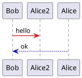
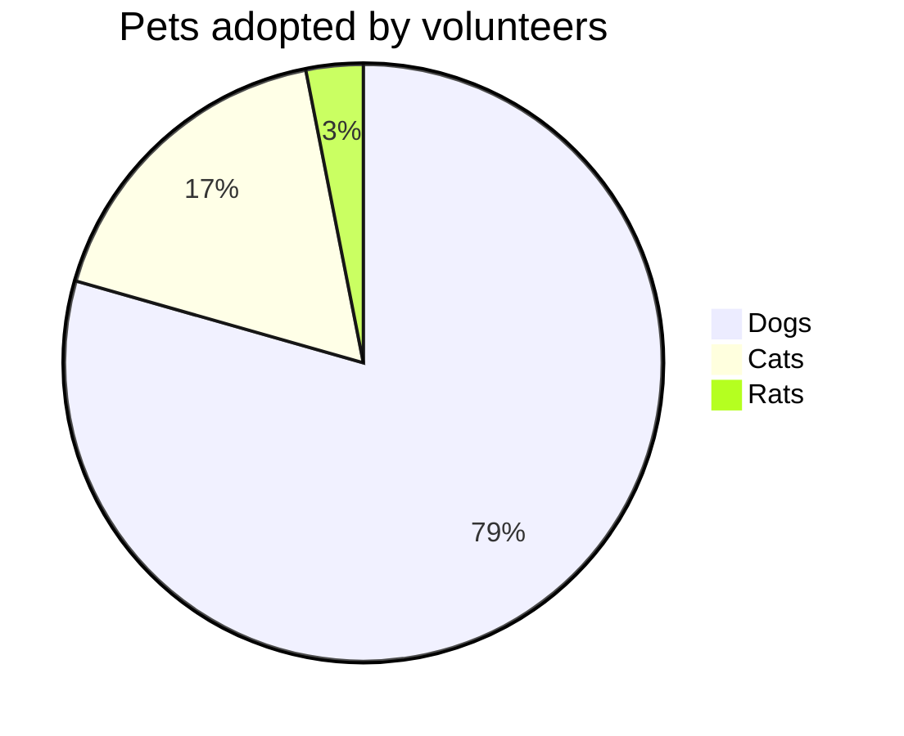

---
presentation:
  width: 1920
  height: 1080
  theme: black.css
---

<!-- slide -->

# Welcome Slide

View the slides with `Markdown Preview Enhanced Extension`

<!-- slide -->

# 1 Slide

<!-- slide vertical=true -->

# 1.1 Slide

Note that the `VSCode outline view` does not show the correct hierarchy of the slides\
unlike `reveal-vs outline view`

<!-- slide vertical=true -->

# 1.2 Slide

<!-- slide -->

# 2 Diagrams
Plant UML, mermaid diagrams

<!-- slide vertical=true -->

# 2.1 Plant UML

<!-- slide vertical=true -->

# 2.2 Mermaid Diagrams

<!-- slide -->

## 3. These are fragments

Fade in

Fade out

Highlight red

Fade in, then out

Slide up while fading in

<!-- slide -->

# 4. THE END
