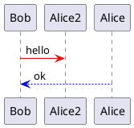
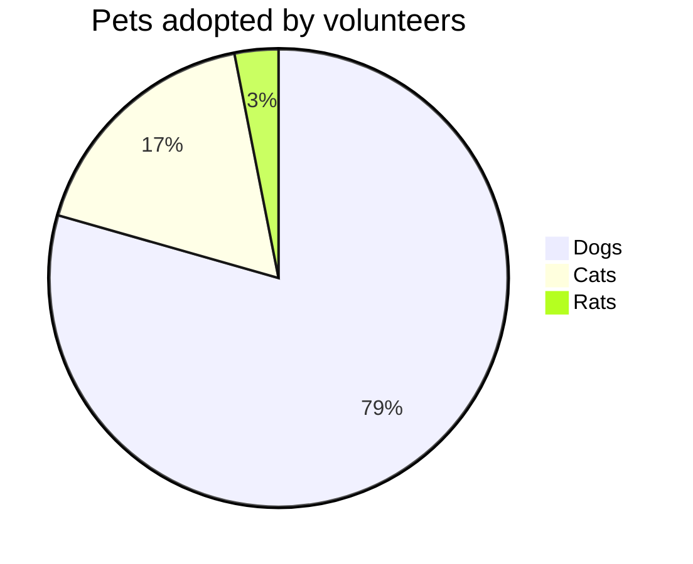

# Welcome Slide

View the slides with `Reveal-VS Preview Window`\
<r2>This will not properly render in `Markdown Preview Enhanced Extension`</r2>

---

# 1 Slide

--

# 1.1 Slide

Note that the `VSCode outline view` does not show the correct hierarchy of the slides\
unlike `reveal-vs outline view`

--

# 1.2 Slide

---

# 2 Diagrams
Plant UML, mermaid diagrams

--

# 2.1 Plant UML



--

# 2.2 Mermaid Diagrams



---

## 3. These are fragments
<p class="fragment">Fade in</p>
<p class="fragment fade-out">Fade out</p>
<p class="fragment highlight-red">Highlight red</p>
<p class="fragment fade-in-then-out">Fade in, then out</p>
<p class="fragment fade-up">Slide up while fading in</p>

---

# 4. Code Block

```js [1-2|3|4]
    let a = 1;
    let b = 2;
    let c = x => 1 + 2 + x;
    c(3);
```

---

# 5. Cool Stuff
with RevealJS Plugins

<canvas width=500 height=500 class="anything">
<!--
{
  "initialize": "function(container) { 
	var width = container.width,
	    height = container.height;
	var radius = height / 2 - 5,
	    scale = radius,
	    velocity = .02;
	var projection = d3.geo.orthographic()
	    .translate([width / 2, height / 2])
	    .scale(scale)
	    .clipAngle(90);
	var context = container.getContext('2d');
	var path = d3.geo.path()
	    .projection(projection)
	    .context(context);
	d3.json('https://rajgoel.github.io/reveal.js-demos/anything/d3/world-110m.json', function(error, world) {
	  if (error) throw error;
	  var land = topojson.feature(world, world.objects.land);
	  d3.timer(function(elapsed) {
	    context.clearRect(0, 0, width, height);
	    context.beginPath();
	    context.arc(width / 2, height / 2, radius, 0, 2 * Math.PI, true);
	    context.lineWidth = 2.5;
	    context.fillStyle = '#fff';
	    context.fill();
	    projection.rotate([velocity * elapsed, 0]);
	    context.beginPath();
	    path(land);
	    context.fillStyle = '#42affa';
	    context.fill();
	    context.beginPath();
	    context.arc(width / 2, height / 2, radius, 0, 2 * Math.PI, true);
	    context.lineWidth = 2.5;
	    context.strokeStyle = '#ccc';
	    context.stroke();
	  });
	});
	d3.select(self.frameElement).style('height', height + 'px');
    }"
}
-->
</canvas>

---

# 6. THE END
