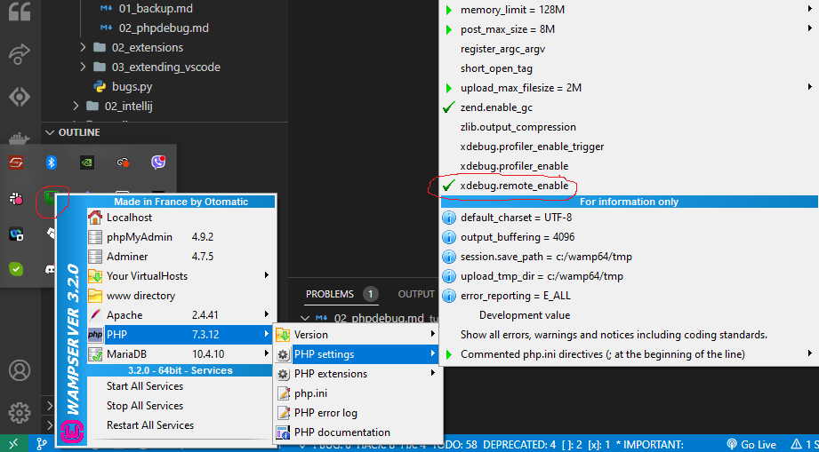
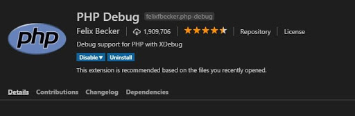
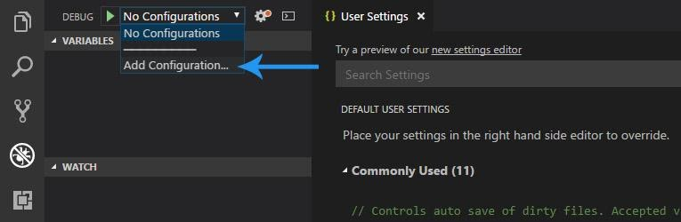
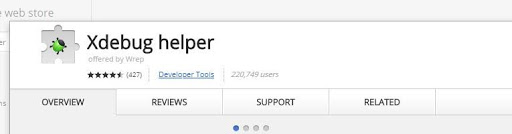
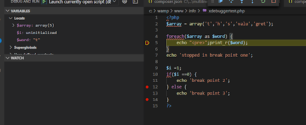

# 0. What is Xdebug
https://www.cloudways.com/blog/php-debug/#xdebug-exactly

# 1. VSCode Setup for PHP Debugging 
<tag>- Ref: https://www.srijan.net/resources/blog/tutorial-using-xdebugger-with-php-vscode-to-debug#:~:text=Go%20to%20any%20.,to%20start%20the%20debug%20process</tag>

## 1.1 Setup for VSCODE

> <note>(optional) In `settings.json` add, `"php.validate.executablePath": "C:\\wamp64\\bin\\php\\php7.3.12\\php.exe"`</note>

1. Install WAMP
   
2. Enable xdebug.remote_enable in `php.ini` settings
   



3. Install the `PHP Debug extension`.



4. Click on the Debug tab on the left-hand pane. Click `“Add Configuration”`




5. Add the following in `launch.json`

```json
{
    // Use IntelliSense to learn about possible attributes.
    // Hover to view descriptions of existing attributes.
    // For more information, visit: https://go.microsoft.com/fwlink/?linkid=830387
    "version": "0.2.0",
    "configurations": [  

        /* Listen for XDebug */
        /* You will have to manually open Chrome goto 'localhost/<web>' */
        {
            "type": "php",
            "request": "launch",
            "name": "Listen for XDebug",
            "port": 9000
        },

        /* This is just to launch Chrome instance */
        {
            "type": "pwa-chrome",
            "request": "launch",
            "name": "Launch Chrome against localhost",
            "url": "http://localhost/tbb_2016/", // <-- web address localhost
            "webRoot": "${workspaceFolder}"
        },

        /* Optional */
        /* To debug currently open file */
        {
            "type": "php",
            "request": "launch",
            "program": "${file}",
            "cwd": "${fileDirname}",
            "name": "Launch currently open script",
            "port": 9000
        }
    ]
}
```

## 1.2 Setup for Chrome Browser
1. Go to the following URL https://chrome.google.com/webstore/category/extensions
2. Search for ‘xDebug Helper’ and install



## 1.3 Debug Currently Open File
<tag>- Ref: https://stackoverflow.com/questions/43783482/visual-studio-code-php-debugging-not-working</tag> 

1. Goto `C:\wamp64\bin\apache\apache2.4.41\bin\php.ini` (currently active `php.ini`)
2. Grab the config for `xdebug` extension 
   
```json
[xdebug]
zend_extension="c:/wamp64/bin/php/php7.3.12/zend_ext/php_xdebug-2.8.0-7.3-vc15-x86_64.dll"
xdebug.remote_enable = On
xdebug.profiler_enable = off
xdebug.profiler_enable_trigger = Off
xdebug.profiler_output_name = cachegrind.out.%t.%p
xdebug.profiler_output_dir ="c:/wamp64/tmp"
xdebug.show_local_vars=0
```
 3. Copy it to `php.ini` in the `php` path configured in `settings.json`

i.e. 
`php.ini` in `C:\wamp64\bin\php\php7.3.12`

> <note>VSCode uses the `php` installed in the location specified in `settings.json`</note>

4. Add the following lines to `php.ini` in `C:\wamp64\bin\php\php7.3.12` to enable current php file debugging.

```json
[xdebug]
zend_extension="c:/wamp64/bin/php/php7.3.12/zend_ext/php_xdebug-2.8.0-7.3-vc15-x86_64.dll"
xdebug.remote_enable = On
xdebug.profiler_enable = off
xdebug.profiler_enable_trigger = Off
xdebug.profiler_output_name = cachegrind.out.%t.%p
xdebug.profiler_output_dir ="c:/wamp64/tmp"
xdebug.show_local_vars=0

// Add the following lines to enable current php file debugging
xdebug.mode = debug
xdebug.remote_enable = 1 
xdebug.remote_autostart = 1
xdebug.remote_port = 9000
```


YOU ARE READY!!


# 2. Testing

As both debug methods are set up, we need to learn how to use them.


**For Single File Debugging**\
\# TODO: Find out why this option is not working

The first thing would be to use the “Launch currently open script” method.

1. Go to any .php file, and add some breakpoints to your code (`Shortcut - F9` on the keyboard).
2. Make sure that `‘Launch currently open script’` is already selected in the Debug drop-down in the top left of the debug window.
4. Press F5 to start the debug process.
5. You will see the debugger break at the first breakpoint. See the pictures below for reference:




**For Web Project Debugging**

Now, let’s go through the ‘Listen for xDebug method” which takes the browser into account.

1. Open a `.php` file in the web project.
2. Add some breakpoints. Use the F9 shortcut key to add breakpoints.
3. Change the Debug select option to `‘Listen for xDebug’`.
4. Press F5 to start the debugger.
5. Open Chrome and navigate to your `index.php` file i.e. `http://localhost/tbb_2016`
6. Click the new `XDebug Helper extension` and click the `Debug` option.
7. You will notice that helper icon **has turned turn green**
8. Finally, refresh the page in the browser to let VSCode react and start the debugging process.
9. Go back into VSCode and you will see that it has stopped at the breakpoint.

## 3. Creating a Task and Shortcuts

To create a task and assign a shortcut, refer to [here](../00_essentials/01_basics.md#task-to-run-launch-configurations)