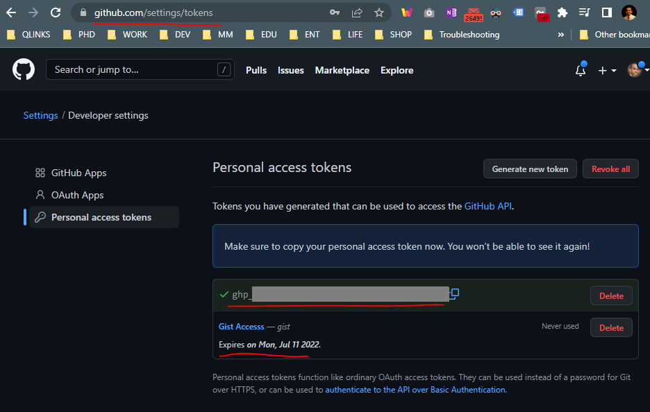

# 1. Settings Sync Extension
<tag>- Ref: https://marketplace.visualstudio.com/items?itemName=Shan.code-settings-sync</tag>

Share everything from one pc to another.

Usage: https://www.youtube.com/watch?v=jeaoUxCYtvk


**Features**

1. Use your GitHub account token and Gist.
2. Easy to Upload and Download on one click.
3. Show a summary page at the end with details about config and extensions effected.
4. Auto download Latest Settings on Startup.
5. Auto upload Settings on file change.
6. Share the Gist with other users and let them download your settings.
7. Supports GitHub Enterprise
8. Support pragmas with @sync keywords: host, os and env are supported.
9. GUI for changing settings / logging in
10. Allows you to Sync any file across your machines.

**Syncs:**

All extensions and complete User Folder that Contains
1. Settings File
2. Keybinding File
3. Launch File
4. Snippets Folder
5. VSCode Extensions & Extensions Configurations
6. Workspaces Folder


> <note><ext>Setting Sync Extension</ext>, by default syncs `C:\Users\<user>\AppData\Roaming\Code\User` folder.</note>

## 1.1 Shortcuts

1. Upload Key : `Shift` + `Alt` + `U` or `> Sync: Update/Upload Settings`
2. Download Key : `Shift` + `Alt` + `D` or `> Sync: Download Settings`


## 1.2 Configure Settings Sync
Requires two things to setup:

- `GitHub Token`
- `GitHub Gist ID`[ <tag>_(where is gist id?)_</tag>](#151-where-is-gist-id)

> <note>`GitHub token` will be used to access `Gist` (specified with `Gist ID`) if you are writing the settings to the gist.</note>

i.e. `GitHub Token`


Following are the steps you need to perform to configure.

1. Click on Login with GitHub.
2. Login GitHub on Browser and close the browser tab once you get Success message.
3. If you are using Settings Sync first time GIST will be created automatically when you upload settings. 
4. If you already have GitHub Gist, new window will be opened to allow you to select the GitHub Gist or Skip to create new Gist.
   
Ref: https://youtu.be/f-uzUsHTQ8s


<o>Alternatively, manual method of configuration:</o>

1. In `settings.json` specify `"sync.gist" : <gist_id>`
2. Access global settings via `> Sync: Advanced Options `-> `Edit Extension Local Settings`
3. It will open `C:\Users\<user>\AppData\Roaming\Code\User\syncLocalSettings.json` file

```yaml
{
    // Files matching the following names must be ignored.
    "ignoreUploadFiles": [
        "state.*",
        "syncLocalSettings.json",
        ".DS_Store",
        "sync.lock",
        "projects.json",
        "projects_cache_vscode.json",
        "projects_cache_git.json",
        "projects_cache_svn.json",
        "gpm_projects.json",
        "gpm-recentItems.json"
    ],

    // Folders to ignore in User folder
    // C:\Users\<user>\AppData\Roaming\Code\User\
    "ignoreUploadFolders": [
        "workspaceStorage",
        "History",
        "sync"
    ],

    // This is the name of gist you are going to create. Very helpful when you 
    // have multiple environments ( e.g Home Settings, Work Settings ) you can 
    // name those gist and download them by identifying.
    "gistDescription": "Personal Settings",

    // GitHub Token
    // Only required if you are writing to the gist (not in download only mode)
    "token": "ghp_...",
    
    // false by default. Set it to true if you are looking forward to make 
    // Setting Sync only download mode. For example, team member looking 
    // forward to the team environment. Set it to true and Settings Sync will 
    // only download the Gist and will never ask for token in order to download.    
    "downloadPublicGist": false,
    
    // Prompt gist description (name) when creating a new gist to sync settings
    // This is the case if "sync.gist" is not specified in settings.json
    "askGistDescription": true,

    // Any custom files to be synced must be listed here
    "customFiles": { 
        "dictionary-general-words.txt": "C:\\Users\\chath\\.test\\dictionary-general-words.txt" 
    },

    "autoUploadDelay": 20
}

```

> <note>`GitHub token` is <r2>not required</r2> if Setting Sync is in download mode (`downloadPublicGist` = `true` in the global settings above)</note>


## 1.3 Configurations for Settings Sync
<tag>- Ref: https://dev.to/shanalikhan/visual-studio-code-settings-sync-configurations-mn0</tag>

There are two types of configurations for Settings Sync in terms of their scope.

- Gist Setting
- Global Settings

`Setting Sync` `Global Settings` is the setting which applies on all the Visual Studio Code environment while the scope of `Gist Settings` are only limited to Visual Studio current environment.

> <note>For Example: `GitHub` Token is a part of ``Global Settings`` of two reasons, first its sensitive information for the user that we cannot allow to upload the GitHub token along-with code settings in `Gist`. Second its applicable with all Gist, it's required to download any `Gist`.</note>

### 1.3.1 Gist Settings
Can go in `settings.json` file
```yaml
{  
    "sync.gist": "",
    "sync.autoDownload": false,
    "sync.autoUpload": false,
    "sync.forceDownload": false,
    "sync.removeExtensions": true,
    "sync.syncExtensions": true,
    "sync.forceUpload": false,
    "sync.quietSync": false
}
```

### 1.3.2 Global Settings
Global Settings are stored in the User folder with the file name `syncLocalSettings.json`. Please refer to [1.2 Configure Settings Sync](#12-configure-settings-sync).

## 1.4 Sharing Settings

You can now share your visual studio code settings with your users or team members, you will just edit the settings or upload your extensions, it will automatically download in your users computers.

Make sure you have Github Access Token. You need to Configure it if its not setup.


### 1.4.1 Creating GIST To Share
By default extension creates the `secret GIST` so only you can see it from your github page. So you need to create the `public GIST` so anyone can see your GIST contents.

`>Sync : Advance Options > Share Settings with Public GIST`

It will remove your current Gist and create new public Gist and upload the settings. You can share your GIST ID with other users so they can download those settings using your gitHub Gist.

> <note>You can also share your `secret GIST` ID with your team member to download settings.</note>


### 1.4.2 Downloading The Settings From Shared GIST

Settings Sync, by default ask for Github Token to download the settings, but **if you are download from Public Gist the token isnt required**. You need to **turn on the public Gist download mode as**:

`> Sync : Advance Options > Download Settings from public Gist`

Now when you download the settings, it will download from the Public Gist that is available in Code Settings file.

**Extension dont allow users to edit or change the Gist of other Users.** 
<!-- #TODO: Test Extension dont allow users to edit or change the Gist of other Users. -->

> <note>You can also share your `secret GIST` ID with your team member to download settings.</note>

## 1.5 FAQ

### 1.5.1 Where is Gist ID?
<tag>- Ref: https://www.quora.com/How-can-I-get-the-gist-id-of-a-code-snippet-in-Github</tag>

GistID it’s the part of the URL after your account to GitHub. After clicking on one of your gists your browser will ber redirected to the URL like that:

`https://github.com/<your_user_name>/<gistID>`

and after your account name you can see your GistID.