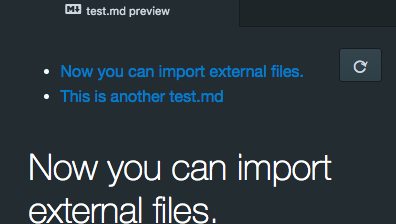
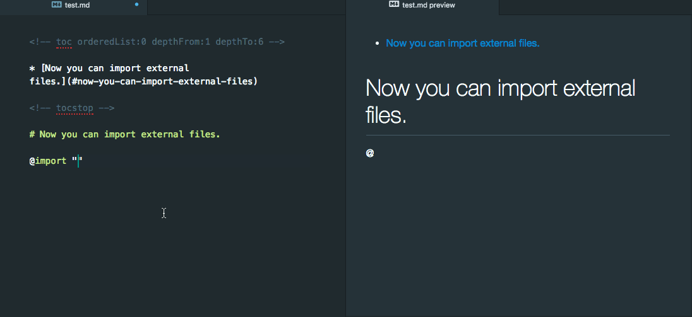
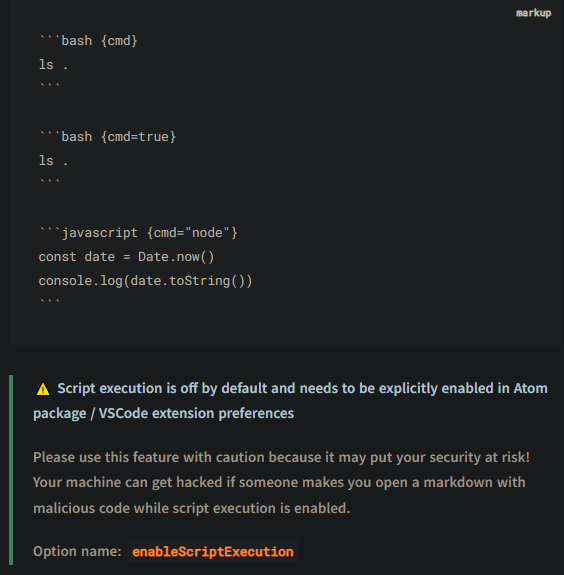
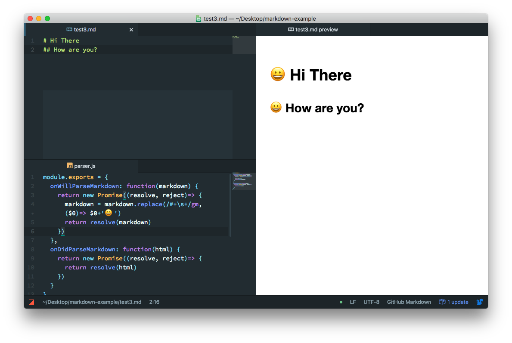
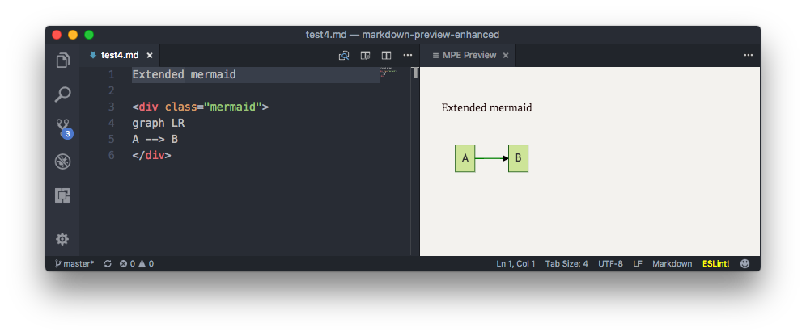
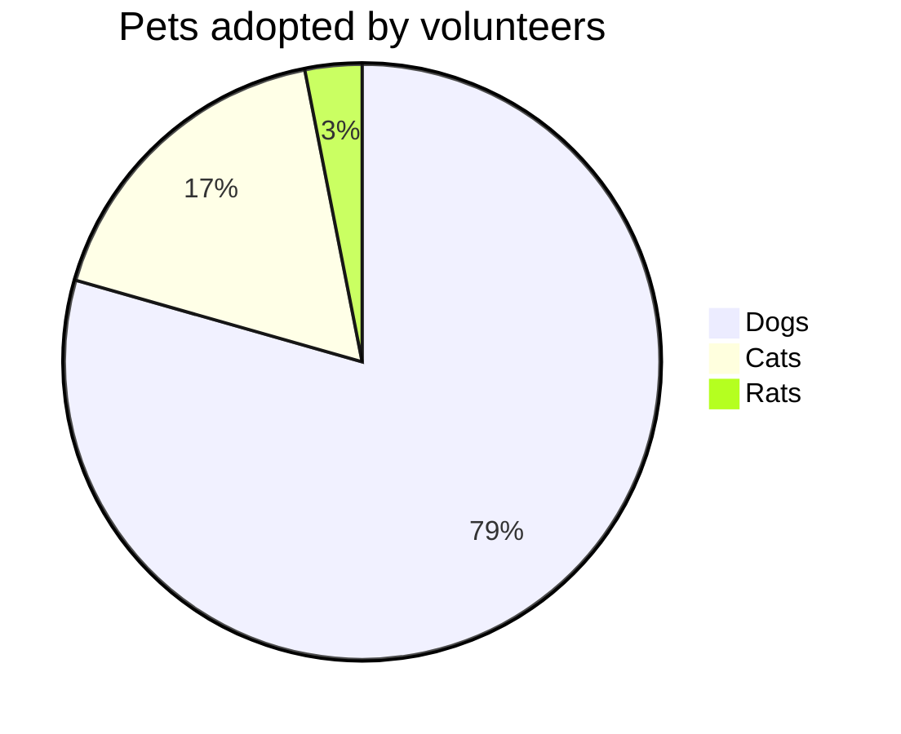
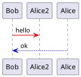

# 1. Markdown Preview Enhanced Extension
<tag>- Ref: https://shd101wyy.github.io/markdown-preview-enhanced/#/</tag>

> <note> Some of the configuration are not listed in the official help (i.e. <! slide vertical=true>). Use search box on the link above to find a feature.</note>

## 1.1 Configuration
```yaml
{
    // to print the background in pdf as is.
    "markdown-preview-enhanced.printBackground": true,

    // The configuration directory path. Leave it empty to use '~/.mume' as the config path. Please reload vscode to take effect.
	  "markdown-preview-enhanced.configPath": "",
}
```

## 1.2 Markdown Printing in PDF

- Use default chromium `print PDF` option.
- Alternatively,
  - View in browser
  - Edit the styles in [style.less](https://shd101wyy.github.io/markdown-preview-enhanced/#/customize-css), margins and render it in web browser. 
  - Use browser print

## 1.3 Custom Style Support
<tag>- Ref: https://shd101wyy.github.io/markdown-preview-enhanced/#/customize-css</tag>

**style.less**
To customize css for your markdown file, cmd-shift-p then run Markdown Preview Enhanced: Customize Css command.

The style.less file will open, and you can override existing style like this:

`style.less file is located at ~/.mume/style.less`

```
.markdown-preview.markdown-preview {
  // please write your custom style here
  // eg:
  //  color: blue;          // change font color
  //  font-size: 14px;      // change font size
  // custom pdf output style
  @media print {
  }

  // custom prince pdf export style
  &.prince {
  }

  // custom presentation style
  .reveal .slides {
    // modify all slides
  }

  .slides > section:nth-child(1) {
    // this will modify `the first slide`
  }
}

.md-sidebar-toc.md-sidebar-toc {
  // sidebar TOC style
}
```

### 1.3.1 Local style

Markdown Preview Enhanced also allows you to define different styles for different markdown files.
id and class can be configured inside `front-matter`. You can import a less or css file in your markdown file easily:

markdown.md file

```markdown
---
id: "my-id"
class: "my-class1 my-class2"
---

@import "my-style.less"

# Heading1
```

the `my-style.less` could look like this:

```css
#my-id {
  background-color: #222;
  color: #fff;

  h1,
  h2,
  h3,
  h4,
  h5,
  h6 {
    color: #fff;
  }
}
```

Every time you changed your less file, you can click the refresh button at the right top corner of the preview to recompile less to css.




## 1.4 Support for TOC (Table of Content)
<tag>- Ref: https://shd101wyy.github.io/markdown-preview-enhanced/#/toc</tag>

Markdown Preview Enhanced can create TOC for your markdown file. You can press cmd-shift-p then choose Markdown Preview Enhanced: Create Toc to create TOC. Multiple TOCs can be created. To exclude a heading from the TOC, append `{ignore=true}` after your heading.

Please refer to the link for more information.

## 1.5 Support `@import`
<tag>- Ref: https://shd101wyy.github.io/markdown-preview-enhanced/#/file-imports</tag>



**syntax:**

`@import "your_file"`

or

`<!-- @import "your_file" -->`


There are a few configuration you can use during file import. Please refer to the link for more details.

## 1.6 Support for Code Execution

<tag>- Ref: https://shd101wyy.github.io/markdown-preview-enhanced/#/code-chunk</tag>

Markdown Preview Enhanced allows you to render code output into documents.



## 1.7 Extending Markdown Parser
<tag>- Ref: https://shd101wyy.github.io/markdown-preview-enhanced/#/extend-parser</tag>

Run\
`> Markdown Preview Enhanced: Extend Parser`

Then edit the `parser.js` file.

`parser.js` file is located at `~/.mume/parser.js`

```yaml
module.exports = {
  onWillParseMarkdown: function(markdown) {
    return new Promise((resolve, reject) => {
      return resolve(markdown);
    });
  },
  onDidParseMarkdown: function(html) {
    return new Promise((resolve, reject) => {
      return resolve(html);
    });
  },
};
```

For example, if you want to prepend 😀 to every headers, then just edit onWillParseMarkdown like this:

```yaml
module.exports = {
  onWillParseMarkdown: function(markdown) {
    return new Promise((resolve, reject) => {
      markdown = markdown.replace(/#+\s+/gm, ($0) => $0 + "😀 ");
      return resolve(markdown);
    });
  },
};
```



For example, if you want to use <div class="mermaid"></div> for mermaid graph.

```yaml
module.exports = {
  onWillParseMarkdown: function(markdown) {
    return new Promise((resolve, reject) => {
      markdown = markdown.replace(
        /\<div\s*class\=\"mermaid\"\>([\w\W]+?)\<\/div\>/g,
        (whole, content) => `
\`\`\`mermaid
${content}
\`\`\`
        `,
      );
      return resolve(markdown);
    });
  },
};
```



## 1.8 Support for Diagrams
<tag>- Ref: https://shd101wyy.github.io/markdown-preview-enhanced/#/diagrams</tag>

Supports rendering flow charts, sequence diagrams, `mermaid`, `PlantUML`, `WaveDrom`, `GraphViz`, `Vega & Vega-lite`, `Ditaa` diagrams. You can also render `TikZ`, `Python Matplotlib`, `Plotly` and all sorts of other graphs and diagrams by using code block in markdown.

> <note>❗️ Important: Please note that some diagrams don't work well with file exports such as PDF, pandoc, etc.<note>

### `mermaid` Diagram



<details>
    <summary>Show code</summary>

    ```mermaid
    pie title Pets adopted by volunteers
        "Dogs" : 386
        "Cats" : 85
        "Rats" : 15
    ```
</details>

### `plantuml` Diagram



<details>
    <summary>Show code</summary>

    ```plantuml
    @startuml
    Bob -[#red]> Alice2 : hello
    Alice -[#0000FF]->Bob : ok
    @enduml
    ```
</details>

### `sequence` Diagram
<tag>- Ref: https://shd101wyy.github.io/markdown-preview-enhanced/#/diagrams</tag>\
<tag>- Ref: https://bramp.github.io/js-sequence-diagrams/</tag>


## Support for Presentation (Reveal JS)
<tag>- Ref: https://shd101wyy.github.io/markdown-preview-enhanced/#/presentation</tag>

- <r2>Not as powerful as [Reveal-VS Extension](#reveal-vs-extension)</r2>
- No TOC view on the side.

### Configuration

You can configure your presentation by adding front-matter to your markdown file.
You need to write your settings under `presentation` section.
For example:

`your_markdown_file.md`
```yaml
---
presentation:
  width: 800
  height: 600
---

<!-- slide --> // to insert a slide

# Slide Header Topic
...

<!-- slide vertical=true --> // to insert a vertical slide

# Slide Header Topic
...

```

Full list of presentation settings.
```yaml
---
presentation:
  # presentation theme
  # === available themes ===
  # "beige.css"
  # "black.css"
  # "blood.css"
  # "league.css"
  # "moon.css"
  # "night.css"
  # "serif.css"
  # "simple.css"
  # "sky.css"
  # "solarized.css"
  # "white.css"
  # "none.css"
  theme: white.css

  # The "normal" size of the presentation, aspect ratio will be preserved
  # when the presentation is scaled to fit different resolutions. Can be
  # specified using percentage units.
  width: 960
  height: 700

  # Factor of the display size that should remain empty around the content
  margin: 0.1

  # Bounds for smallest/largest possible scale to apply to content
  minScale: 0.2
  maxScale: 1.5

  # Display controls in the bottom right corner
  controls: true

  # Display a presentation progress bar
  progress: true

  # Display the page number of the current slide
  slideNumber: false

  # Push each slide change to the browser history
  history: false

  # Enable keyboard shortcuts for navigation
  keyboard: true

  # Enable the slide overview mode
  overview: true

  # Vertical centering of slides
  center: true

  # Enables touch navigation on devices with touch input
  touch: true

  # Loop the presentation
  loop: false

  # Change the presentation direction to be RTL
  rtl: false

  # Randomizes the order of slides each time the presentation loads
  shuffle: false

  # Turns fragments on and off globally
  fragments: true

  # Flags if the presentation is running in an embedded mode,
  # i.e. contained within a limited portion of the screen
  embedded: false

  # Flags if we should show a help overlay when the questionmark
  # key is pressed
  help: true

  # Flags if speaker notes should be visible to all viewers
  showNotes: false

  # Number of milliseconds between automatically proceeding to the
  # next slide, disabled when set to 0, this value can be overwritten
  # by using a data-autoslide attribute on your slides
  autoSlide: 0

  # Stop auto-sliding after user input
  autoSlideStoppable: true

  # Enable slide navigation via mouse wheel
  mouseWheel: false

  # Hides the address bar on mobile devices
  hideAddressBar: true

  # Opens links in an iframe preview overlay
  previewLinks: false

  # Transition style
  transition: 'default' # none/fade/slide/convex/concave/zoom

  # Transition speed
  transitionSpeed: 'default' # default/fast/slow

  # Transition style for full page slide backgrounds
  backgroundTransition: 'default' # none/fade/slide/convex/concave/zoom

  # Number of slides away from the current that are visible
  viewDistance: 3

  # Parallax background image
  parallaxBackgroundImage: '' # e.g. "'https://s3.amazonaws.com/hakim-static/reveal-js/reveal-parallax-1.jpg'"

  # Parallax background size
  parallaxBackgroundSize: '' # CSS syntax, e.g. "2100px 900px"

  # Number of pixels to move the parallax background per slide
  # - Calculated automatically unless specified
  # - Set to 0 to disable movement along an axis
  parallaxBackgroundHorizontal: null
  parallaxBackgroundVertical: null

  # Parallax background image
  parallaxBackgroundImage: '' # e.g. "https://s3.amazonaws.com/hakim-static/reveal-js/reveal-parallax-1.jpg"

  # Parallax background size
  parallaxBackgroundSize: '' # CSS syntax, e.g. "2100px 900px" - currently only pixels are supported (don't use % or auto)

  # Number of pixels to move the parallax background per slide
  # - Calculated automatically unless specified
  # - Set to 0 to disable movement along an axis
  parallaxBackgroundHorizontal: 200
  parallaxBackgroundVertical: 50

  # Enable Speaker Notes
  enableSpeakerNotes: false
---
```

---

# Reveal-VS Extension
<tag>- Ref: https://marketplace.visualstudio.com/items?itemName=evilz.vscode-reveal</tag>

**Highlights**

- More powerful then `Markdown Preview Enhanced` Extension's built-in presentation capabilities.
- Marker tools in the presentation view
- TOC view on the side.
- Javascript library/revealjs plugin support via HTML comments.
- reveal-vs outline view to replace VSCode default outline view
  - VSCode default outline view does not show the slide hierarchy correctly.


**Feature List**

- Advanced Markdown syntax :
  - MultiMarkdown table syntax (markdown-it-multimd-table)
  - Add classes, identifiers and attributes to your markdown (markdown-it-attrs)
  - Abbreviation () tag plugin (markdown-it-abbr)
  - accessible markup for block quotes with attribution line (markdown-it-attribution)
  - checkboxes (markdown-it-checkbox)
  - pandoc definition lists. (markdown-it-deflist)
  - adding emoji & emoticon syntax support (markdown-it-emoji)
  - adds Font Awesome icons support (markdown-it-fontawesome)
  - import ins from '@gerhobbelt/markdown-it-ins';
  - import kbd from '@gerhobbelt/markdown-it-kbd';
  - import mark from '@gerhobbelt/markdown-it-mark';
  - import samp from '@gerhobbelt/markdown-it-samp';
  - import sub from '@gerhobbelt/markdown-it-sub';
  - import sup from '@gerhobbelt/markdown-it-sup';
  - taskLists (markdown-it-task-lists)
  - iframe
  - markdownDiv
- Syntax highlight
- <o>chalkboard</o>
- menu
- themes
- zoom
- <o>Speaker notes</o>
- search
- math

## Some Commands

- Use `>RevealJS: Show presentation by side` window to view the slides.

> <note> When `Reveal-VS Presentation Preview` renders a presentation, it creates a `export` folder in the current directory. It will include the generated HTML code with `reveal.js` script file links which will help the preview a beautiful presentation.</note>
>
> <note>❗️ Important: use the generated html code to see whether the markdowns are correctly converted to HTML</note>


- Use `>RevealJS: Open a sample` to view samples.


---

# Markdown PDF Extension
<tag>- Ref: https://marketplace.visualstudio.com/items?itemName=yzane.markdown-pdf</tag>


<r2>This does not correctly print PDF with plantuml diagrams</r2>

Use <ext>Markdown Preview Enhanced Extension</ext> to print markdown to PDF.


# Markdown Preview Markmap Support (for VSCode Default Preview)

View this code in VSCode default markdown view.

```markmap
## Links

- <https://markmap.js.org/>
- [GitHub](https://github.com/gera2ld/markmap)

## Related

- [coc-markmap](https://github.com/gera2ld/coc-markmap)
- [gatsby-remark-markmap](https://github.com/gera2ld/gatsby-remark-markmap)
```

```markmap {scale=1.5 color=#888}
## Links

- <https://markmap.js.org/>
- [GitHub](https://github.com/gera2ld/markmap)

## Related

- [coc-markmap](https://github.com/gera2ld/coc-markmap)
- [gatsby-remark-markmap](https://github.com/gera2ld/gatsby-remark-markmap)
```

\# TODO: Extend Markdown Preview Enhanced to supposer markmap by referring to https://github.com/phoihos/vscode-markdown-markmap