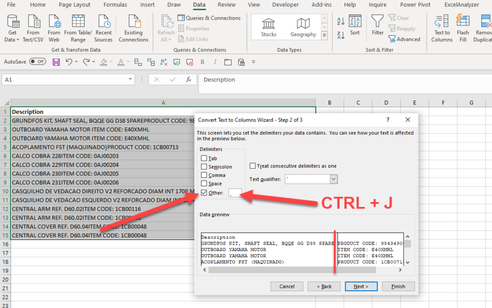

# Importing Data to Excel

## Text to columns

### <o>Use line break as the delimiter?</o>

## Transpose columns to rows

1. Select the range of data you want to rearrange, including any row or column labels, and press Ctrl+C.
   
> <note>Note: Ensure that you copy the data to do this, since using the Cut command or Ctrl+X won’t work.</note>

2. Paste it via:

