# 0. Bugs

1. VS Code does not properly display the long text title, the last few part will be truncated as showed in follow:
https://stackoverflow.com/questions/59385232/how-to-type-in-multiple-spaces-in-mermaid


Another Ref:\
https://stackoverflow.com/questions/59385232/how-to-type-in-multiple-spaces-in-mermaid\
Refer to Step-6c. Ensuring all the title is visible


# 1. Diagram Types

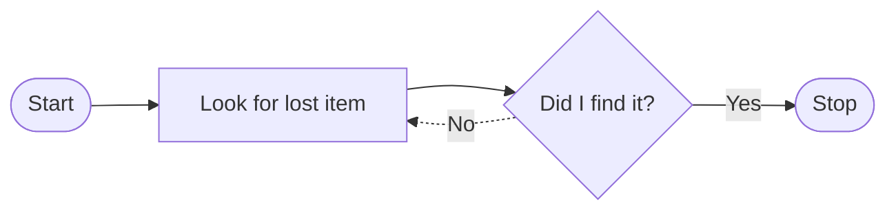

## 1.1 Flowcharts

### 1.1.1 Simple


### 1.1.2 Advanced

A single space is allowed between vertices and the link. However there should not be any space between a vertex and its text and a link and its text. 

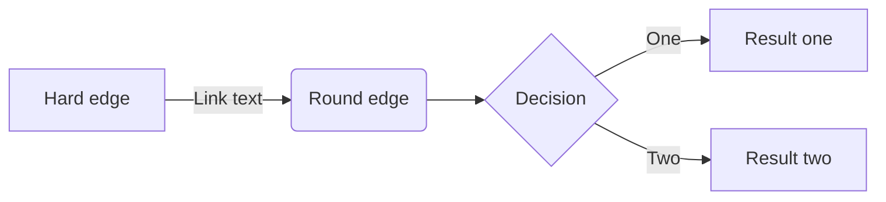

## 1.2 Sequence Diagrams

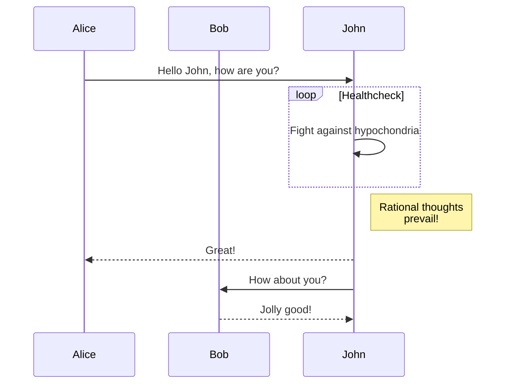

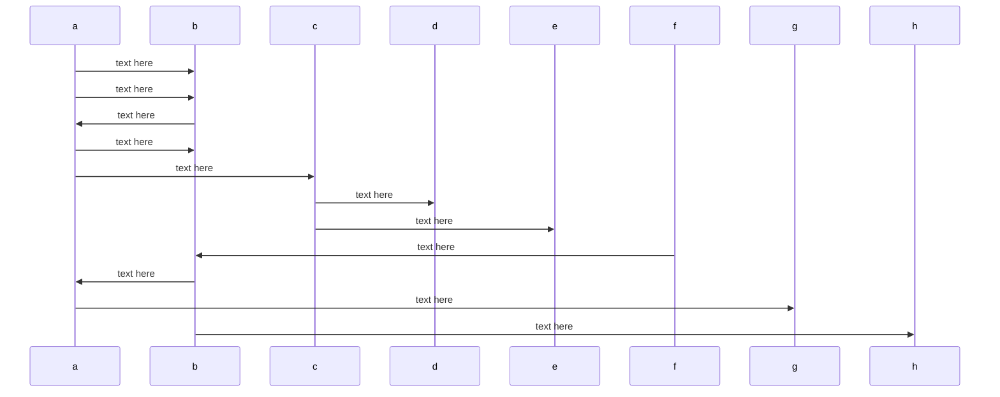

## 1.3 Gantt Diagram

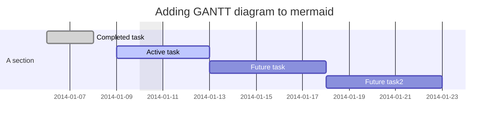

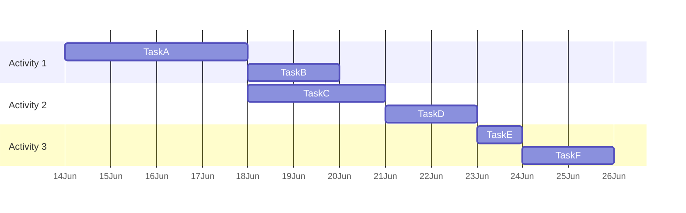

## 1.4 Class Diagram

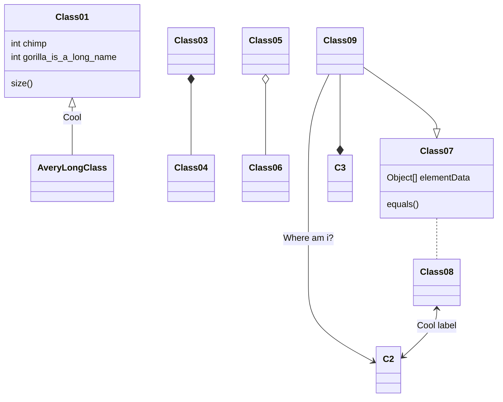

<script>
var callback = function () {
    alert('A callback was triggered');
};
var config = {
    startOnLoad: true,
    flowchart: { useMaxWidth: true, htmlLabels: true, curve: 'cardinal' },
    securityLevel:'loose'
};
mermaid.initialize(config);
</script>

```mermaid
classDiagram
  direction RL
  class Student {
    -idCard : IdCard
  }
  class IdCard{
    -id : int
    -name : string
  }
  class Bike{
    -id : int
    -name : string
  }
  Student "1" --o "1" IdCard : carries
  Student "1" --o "1" Bike : rides


  linkStyle default fill: none, stroke: red;
```

## 1.5 Git Graph

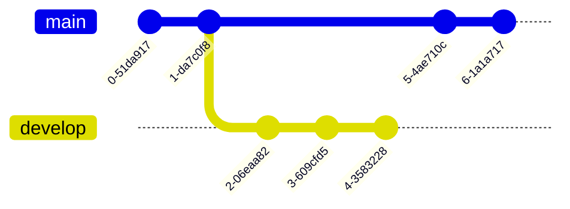

## 1.6 ER Diagram

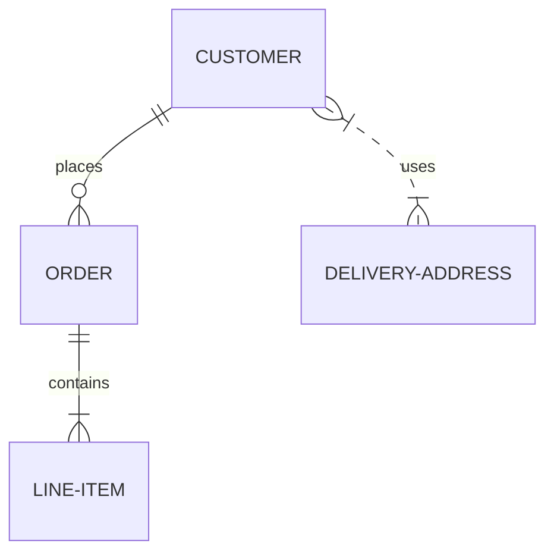

## 1.7 User Journey Diagram

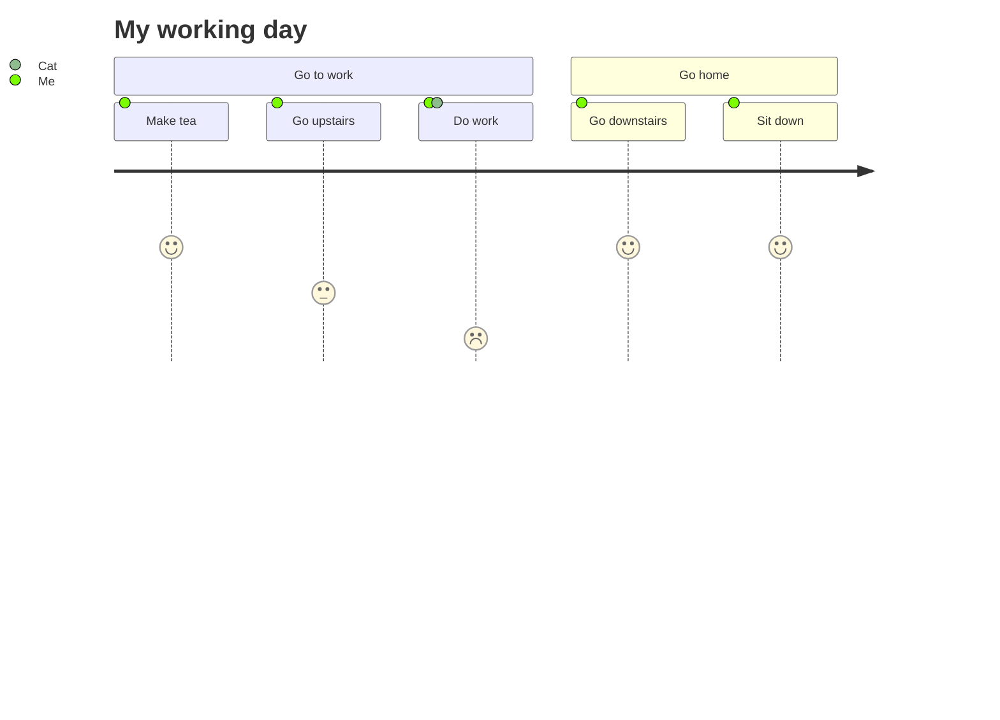

---

# 2. Styling and Classes
<tag>- Ref: https://mermaid-js.github.io/mermaid/#/flowchart?id=styling-and-classes</tag>

## 2.2 Styling Links

It is possible to style links. For instance you might want to style a link that is going backwards in the flow. **As links have no ids** in the same way **as nodes**, some other way of deciding what style the links should be attached to is required. Instead of ids, **the order number of when the link was defined in the graph is used**, **or use default to apply to all links**. In the example below the style defined in the linkStyle statement will belong to the fourth link in the graph:

`linkStyle 3 stroke:#ff3,stroke-width:4px,color:red;`

## 2.3 Styling a Node

It is possible to apply specific styles such as a thicker border or a different background color to a node.

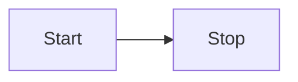

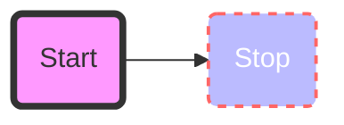

> <note> The style attributes can be found in https://www.w3schools.com/graphics/svg_rect.asp, refer to `<rect>` HTML element.</note>

### 2.3.1 Style Class

More convenient than defining the style every time is to **define a class of styles and attach this class to the nodes** that should have a different look.

**A class definition** looks like the example below:

`classDef className fill:#f9f,stroke:#333,stroke-width:4px;`

**Attachment of a class** to a node is done as per below:

`class nodeId1 className;`

It is also possible to **attach a class to a list of nodes** in one statement:

`class nodeId1,nodeId2 className;`

<o>A shorter form of adding a class is to attach the classname to the node using the `:::`operator as per below:</o>

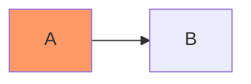

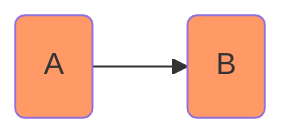

### 2.3.2 Css Classes
<tag>- Ref: https://mermaid-js.github.io/mermaid/#/flowchart?id=css-classes</tag>

It is also possible to predefine classes in css styles that can be applied from the graph definition as in the example below:

> <note>❗️ Important: This is only working with HTML files. <r2>Not working with markdown files.</r2></note>

<r2>\# ! BG: Write styles in external CSS with specificity of the elements.</r2>
> <note> it's tough to write styles in external CSS because of the specificity of the elements. When mermaid initializes, it creates an svg with a random id. The autogenerated CSS then targets this id in the CSS selector. Trying to write CSS that targets certain elements is not possible without either </note>
>   - <note>a) knowing the unique id or </note>
>   - <note>b) using !important. Neither of these follow CSS best practices.</note>
>
> <note> https://github.com/mermaid-js/mermaid/issues/1181#issuecomment-614295937</note>

Can move the following `<style>...</style>` block to 
`> Markdown Preview Enhanced: Custom CSS`

```html
<style>
    .customCss > rect { /* Local */
        fill:#ff0000 !important;
        stroke:#FFFF00 !important;
        stroke-width:4px !important;
    }

    .flowchart-link { /* Global */
        stroke: #ff0000 !important;
    }

    /*  You can only set global color for arrow heads */
    #flowchart-pointEnd {
        fill: #ff0000 !important;
        stroke: #ff0000 !important;
    }

    /* Link between Classes */
    /* .root applicable only to flowchart and class (but not graph) */
    .root .edgePaths path {
        stroke: #00ffff !important;
    }
</style>
```

if `.flowchart-link` needs to go local, use `<div id="abc"> ```mermaid ... ```</div>` and use
```html
<style>
 #abc .flowchart-link {
    ...
    ...
 }
 </style>
```

<style>
    .customCss > rect {
        fill:#ff0000 !important;
        stroke:#FFFF00 !important;
        stroke-width:4px !important;
    }

    /* Global */
    /*.flowchart-link { 
        stroke: #ff0000 !important;
    }*/

    /*  You can only set global color for arrow heads due to the way mermaid diagrams are rendered in HTML */
    /*#flowchart-pointEnd {
        fill: #ff0000 !important;
        stroke: #ff0000 !important;
    }

    #flowchart-pointStart {
        fill: #ff0000 !important;
        stroke: #ff0000 !important;
    }*/

    /* Link between Classes */
    /* .root applicable only to flowchart and class (but not graph) */
    .root .edgePaths path {
        stroke: #00ffff !important;
    }
</style>

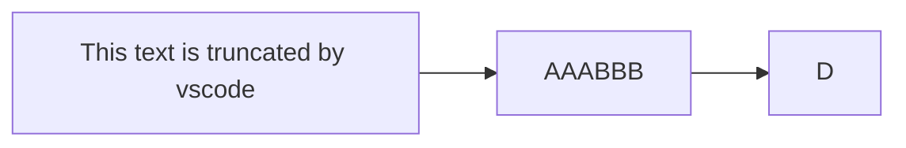

> <note>❗️ Important: Due to limitations with existing markup for class diagrams, <r2>it is not currently possible to define css classes within the diagram itself.</r2> Coming soon!</note>

<style>

</style>

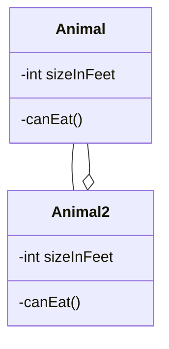

<style>
    #abc .edgePaths path {
        stroke: #00ff00 !important;
    }
</style>

<div id="abc">

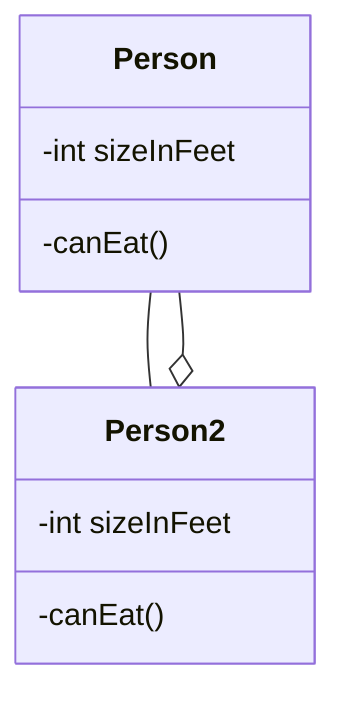

</div>

### 2.3.3 Default class

If a class is named `default` it will be assigned to all classes without specific class definitions.

`classDef default fill:#f9f,stroke:#333,stroke-width:4px;`

---

### 2.3.4 Examples
<tag>- Ref: https://dompl.medium.com/produce-great-looking-flowcharts-in-seconds-7f3bea64f2e2</tag>

**Example 01:**

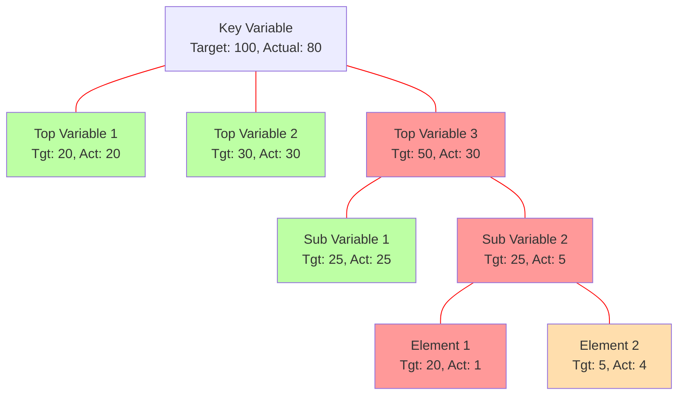

```yaml
{
  "theme": "default",
  "flowchart": {
    "curve": "monotoneY"
  }
}
```
The mermaid config allows adjustment of other parameters, including:\
`> Markdown Preview Enhanced: Open mermaid config`

- **Theme:** Available themes include ‘default’, dark’, ‘neutral’, ‘forest’, ‘base’
- **Curve:** Available line curve options include ‘monotoneY’, ‘basis’, ‘linear’,


**Example 02:**

```mermaid
graph TD
%% Nodes
    0[Key Variable]
    1[Top Variable 1]
    2[Top Variable 2]
    3[Top Variable 3]
    31[Sub Variable 1]
    subgraph SG32 ["Subgraph: Focus in on Sub-Variable"]
        32[Sub Variable 2]
        321[Element 1]
        322[Element 2]
    end

%% Links
    0 --- 1
    0 --- 2
    0 --- 3
    3 --- 31
    3 --- 32
    32 --- 321
    32 --- 322

%% Styling the title subgraph
    classDef Title fill:red, stroke-width:5, color:yellow;
    class SG32 Title;
```

# 3. Configuration...
Is it possible to adjust the width of the rendered flowchart.

This is done by defining mermaid.flowchartConfig or by the CLI to use a json file with the configuration. How to use the CLI is described in the mermaidCLI page. mermaid.flowchartConfig can be set to a JSON string with config parameters or the corresponding object.

```
mermaid.flowchartConfig = {
    width: 100%
}
```

# 4. Mermaid Cheat Sheet
https://jojozhuang.github.io/tutorial/mermaid-cheat-sheet/


# 5. Huge Diagrams (with scrollable view)

<div style="overflow-x:auto">
<div style="width: 1800px;">

```mermaid
gantt
    title A Gantt Diagram
    dateFormat  YYYY-MM-DD
    section Section
    A task           :a1, 2014-01-01, 30d
    Another task     :after a1  , 20d
    section Another
    Task in sec      :2014-01-12  , 12d
    another task      : 24d
```

</div>
</div>